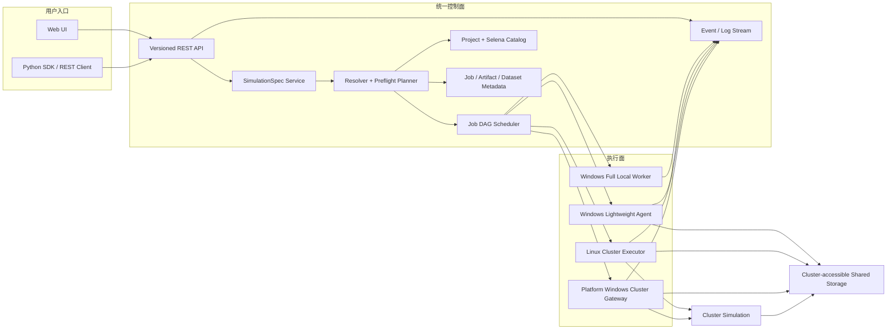
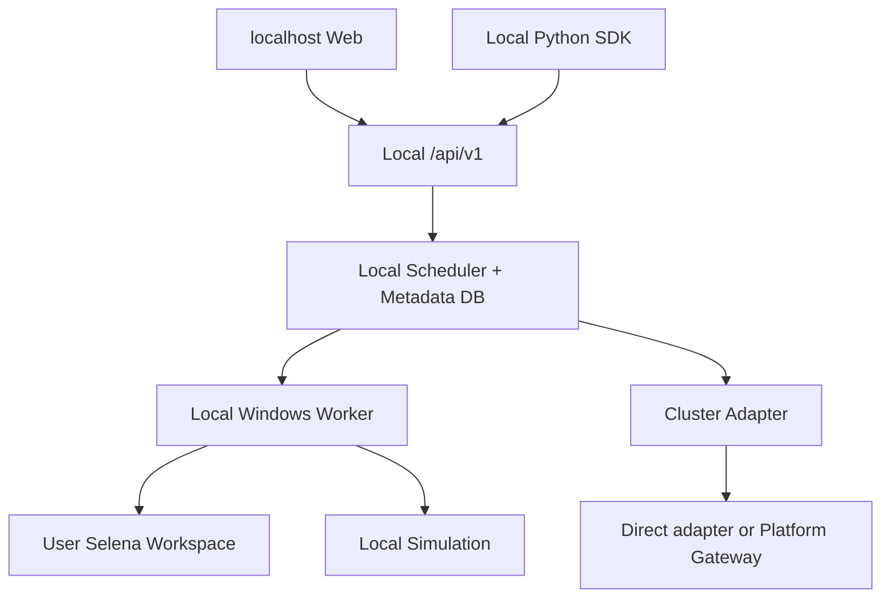
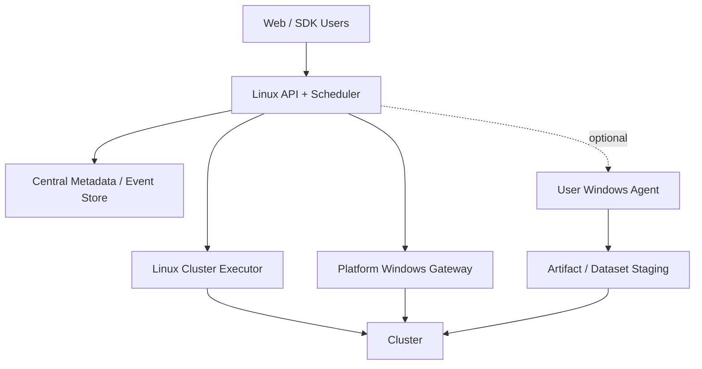
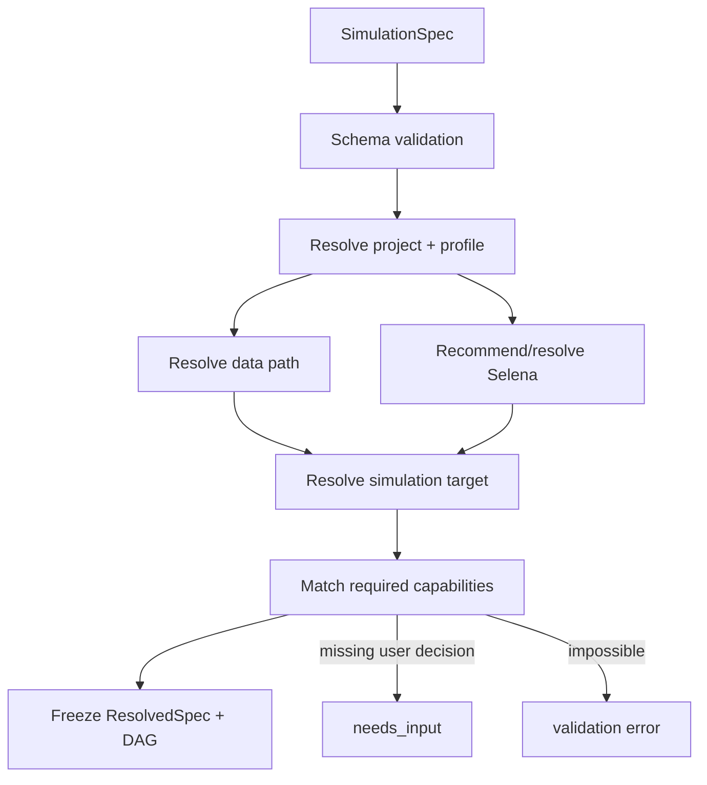
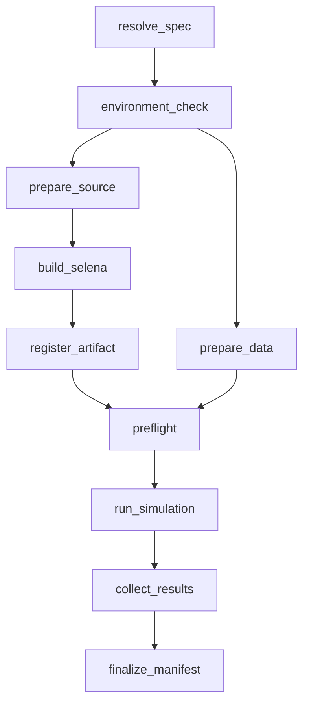

# radar-sim v5 详细设计

> 状态：目标架构与首版迁移设计
> 更新日期：2026-07-15
> 上游需求：`PRD.md` v5.0

## 1. 设计目标与现状判断

本设计把现有多套 CLI、Web handler、Profile、Mode A/B、T1/T2/T3 和控制面原型收敛为一个产品架构：同一份 `SimulationSpec` 经同一 API 和调度器生成执行计划，再由具备能力的 Windows full 本地节点、首版只做编译/上传准备的用户轻量 Agent，或平台 Cluster Worker 执行。

> **设计防漂移基线：** `docs/PRODUCT_CONTRACT.md` 是用户最终确认的权威产品合同。本文历史章节若仍把 Runtime Bundle/project/output_root 等作为用户输入，仅代表旧设计，不再有效。Runtime Bundle 保留为内部打包、传输和缓存实现，公开合同只有 `existing_path + runtime_xml`。

> 2026-07-14 设计收敛：新用户入口合同已经升级为项目无关 `UserRunConfig 2.0`。本文后续仍出现的 `SimulationSpec` 表示兼容/内部适配层，不再表示 Web 用户需要理解项目。权威转换为：`UserRunConfig -> workspace/runtime bundle recognition -> internal project adapter -> ResolvedSpec -> Stage DAG`。

### 0.1 Runtime 与仿真配置边界

- `RuntimeBundle` 是不可变、共享可见、内容寻址的 Selena 执行单元：`selena.exe`、同目录全部 DLL、绑定 Runtime XML、隐藏的分支/commit/dirty/toolchain/internal-adapter evidence。
- MatFilter 是每个任务必选的独立配置；Adapter 是否必需由识别出的内部 recipe 校验（ovrs25/default 可为空，`g3n_fvg3_od25` 必需）。两者均不参与 Selena 编译、不进入 Runtime Bundle，也不参与 Bundle 身份计算。
- Adapter/MatFilter 可由授权 Windows 路径、管理员共享命名空间或用户私有 `ConfigAssetStore` 解析；对外只暴露 `config-asset://sha256/...`。
- Cluster 预检从 `DatasetRef + RuntimeBundleRef + optional AdapterRef + MatFilterRef` 生成私有执行上下文。物理路径、解压目录、Config.cfg、提交命令和凭据只进入 `ClusterRunStore` 私有 lease。

### 0.3 首次 Agent 自动配置与脚本职责

- `selena_build_script` 是实际 Selena 编译入口；Windows Agent 根据本机已安装的 VS C++ toolset 对其中 R2D2 `-vs`/`VS_POSTFIX` 做最小、可见、幂等适配。`package_build_script` 用于识别内部项目适配、静态提取 TCC/toolcollection 等依赖，并执行其明确声明且可安全识别的非交互代码生成步骤；VS 始终由用户自行安装。
- 两个脚本必须位于用户填写的 `code_path` 内，中央只保存用户合同，Agent 回传并继续使用工作区内相对逻辑引用。
- 一键安装的 full/light Agent 声明 `auto_configure`。首次匹配任务可在本机验证路径后登记 workspace/output、Runtime 父目录和数据根；后续心跳只发布哈希化 binding ID，实现“一次配置、永久复用”。
- 工作区识别以用户给出的代码仓和两个脚本为事实来源。已知 adapter 命中时复用其默认值；未命中时生成不含路径的匿名内部身份，并从 Selena 脚本推导输出目录、从两个脚本的有界调用邻域推导环境依赖。不存在 `config/projects/<name>` 不能单独导致任务失败。
- `target=auto` 在提交时基于在线 capability 选择：有 `windows_full` 时优先本地；否则选择 Cluster。`windows_light` 只承担编译/上传，永不成为本地仿真节点。

### 0.2 Cluster Stage 实施拓扑

```text
Linux executor: environment_check -> prepare_data -> preflight
Platform gateway:                         run_simulation (submit only)
Linux executor:                                           collect_results -> finalize_manifest
```

`preflight` 校验并原子解压 Runtime Bundle、解析数据和两项配置、调用现有 `prepare_cluster_job()`，再写 `cluster-run:*` 私有租约；`run_simulation` 只通过 Gateway 提交并返回路径无关状态；`collect_results` 轮询官方状态并形成 `result:sha256:*`；`finalize_manifest` 只拼装 Bundle/Dataset/Run/Result 逻辑引用。不得直接复用旧 `build_run_manifest()` 的绝对路径 `artifacts` 作为公共 Manifest。

本文严格区分：

| 标记 | 含义 |
|---|---|
| Current implementation | 仓库中已存在、可复用或需要迁移的真实代码能力 |
| Target architecture | v5 发布后对 Web、SDK、API、调度和部署的目标合同 |
| Compatibility adapter | 迁移期保留的 CLI、legacy `/api/*`、profile/config 或 control-plane 适配层 |

未标注为 Current 的能力不得在发布说明中写成已完成。

当前仓库并非从零开始，以下基础可复用：

- `core/control_service.py`：SQLite Job/Task/Agent/Log 持久化与 capability 匹配；
- `core/control_http.py`：现有控制面 HTTP handler；
- `core/remote_control.py`：远端控制 client，可演进为 SDK transport；
- `core/web_control.py`：Web 到控制面的兼容桥；
- `cli/agent.py`：Windows polling worker 与本地命令适配；
- `core/server_cluster_executor.py`：Linux server-side `cluster.run` executor；
- `core/cluster.py`：Cluster 打包、提交、等待、结果获取和路径映射；
- `core/data.py`：数据发现和复制能力；
- `core/config.py`、`core/profiles.py`：历史配置、项目和 profile 加载；
- `core/environment.py`、`cli/doctor.py`、`core/tcc.py`：环境检查与部分修复能力；
- `core/preflight.py`、`core/manifest.py`、`core/progress_parser.py`：目标能力的原型。

截至 2026-07-14，`UserRunConfig 2.0`、`/api/v1`、Python SDK、统一 Stage DAG、隔离 worktree、Runtime Bundle、数据/配置上传、Windows full 本地四阶段、Linux Cluster Stage、Bearer 鉴权和 full/light 一键安装均已接入。仍需如实标记的发布限制只有：

- 真实企业 Cluster 共享盘、manager/Gateway 与外部取消只能在目标环境验收；当前仓库证据为 mocked E2E 与历史在线工具链，不得写成已真实提交成功。
- 实际 Selena build 已运行并进入 MSVC，但目标代码仓在 `runtime.cpp(20)` 因析构函数异常规格重定义失败；平台没有绕过或伪造产物。
- 用户复用已有 Selena 时只填写包含 `Selena.exe` 及其 DLL 的文件夹和绑定 Runtime XML；系统在本地或共享路径解析后，内部生成可传输、可校验的 Runtime Bundle，用户不接触 Bundle 概念。
- Windows 安装当前由 Linux Web 提供同源 `connect.cmd`：自动下载白名单应用包、校验 SHA-256、绑定当前服务、注册当前用户计划任务（策略阻止时回退 Startup）并监督断线重连。当前仍未交付企业签名 MSI/Windows Service/静默自动更新；这些属于后续发布加固，不再要求普通用户理解 Agent 参数。

### 1.1 首版实现原则

- 迁移优先于重写：复用现有 `control_service`、`control_http`、`web_control`、`server_cluster_executor`、`cluster`、`data`、`environment`、`repo` 等模块，外层补齐 v5 合同和适配器。
- 先闭环最小纵切，再扩展体验：`SimulationSpec -> validate -> submit -> Stage events -> Manifest` 必须先跑通 Web 与 SDK 的同合同链路。
- P0 不实现 Linux Selena 编译，也不实现平台托管编译农场；任何 Selena 编译只路由到用户授权 Windows full/agent 节点。
- Windows 轻量 Agent 首版只执行授权工作区 Selena 本地编译、产物登记/校验/上传、必要数据检索/校验/上传，并把任务交还中央调度；它不支持本地仿真，也不是 Cluster 仿真运行期依赖。
- 本地仿真只属于 Windows full deployment；无部署用户只能使用 existing Selena + shared/uploaded data 进行 Cluster 仿真。
- 无 Windows 用户的 P0 路径只能是已有 Selena + Cluster；若 Linux 无法直接提交旧 Cluster，则使用平台 Windows Gateway/Worker。
- UserRunConfig 默认直接编译当前工作区；填写的 branch 只是期望值。任何可选的冻结/清仓构建在接入前必须证明不静默 checkout/stash/reset/force 用户主工作区。

### 1.2 复用优先 / Build vs Reuse

#### 1.2.1 决策规则

P0 默认基于现有代码改造；只有在现有代码缺少标准能力、且成熟独立模块或标准协议能显著降低风险时才引入依赖。禁止因为引入某个库而重写调度器、执行器或前端。

每个新依赖必须先做小型 spike，并记录在 `HANDOFF.md`：

1. 解决的缺口；
2. 复用现有哪个模块或边界；
3. 引入成本和风险；
4. PoC/退出标准；
5. 回退方案；
6. 版本 pin、许可证审查、漏洞/维护状态、内部镜像或 vendoring、Windows/Linux 离线打包、代理/证书兼容。

缺少上述任一证据，spike 不通过。WinSW 只默认评估已批准的 stable 版本，不默认采用 pre-release。

#### 1.2.2 保留并封装的现有能力

| 能力 | 当前代码证据 | v5 处理方式 |
|---|---|---|
| Control-plane persistence and task claim | `core/control_service.py`、`core/control_http.py` | 保留 SQLite 与 claim/pinning 语义，外层增加 v1 application service、Stage/Event schema 和 legacy adapter |
| Windows polling Agent | `cli/agent.py` | 保留任务执行和日志流能力，改造成 Stage adapter；服务化和安装交给 packaging WP，不重写 executor |
| Server-side Cluster executor | `core/server_cluster_executor.py` | 保留 Linux `cluster.run` 执行器，补足 no-build capability、Gateway fallback、外部 job id 和 Stage event |
| Cluster packaging/submission | `core/cluster.py` | 拆分 prepare/submit/wait/fetch 幂等边界，继续承载 SZHRADAR 兼容逻辑 |
| Data discovery/adaptivity | `core/data.py` | 保留 MF4 扫描、路径分类、访问检查，外层补 `DatasetRef` 与上传协议 |
| Environment and TCC | `core/environment.py`、`cli/doctor.py`、`core/tcc.py` | 保留检查/修复能力，统一输出 capability health、actions 和 EnvironmentSnapshot |
| Preflight / Manifest / Progress parser | `core/preflight.py`、`core/manifest.py`、`core/progress_parser.py` | 保留原型，必须接入真实 Stage/Event 后才算 v5 完成 |
| Git operations | Git CLI via `core/repo.py` | 默认只读取 branch/HEAD/dirty fingerprint 并编译当前工作区；detached worktree 仅保留给未来显式冻结构建；禁止隐藏 checkout/reset/clean 行为 |
| YAML | PyYAML through existing config loader | 保留 YAML codec 能力，结合 schema/model 做 `SimulationSpec` round-trip |
| Local persistence | SQLite | P0 保留 SQLite；schema migration 先用显式 SQL 和备份，不引入 ORM 迁移栈 |
| Web frontend | existing vanilla `web/*` | P0 保留原生 HTML/CSS/JS，改为 v1 API client；不做 React 重写 |

#### 1.2.3 P0 spike 后采用的成熟模块 / 标准协议

| 选型 | 官方参考 | 解决的缺口 | 复用现有模块 | 成本/风险 | PoC / 退出标准 | 回退方案 |
|---|---|---|---|---|---|---|
| Pydantic v2 | https://docs.pydantic.dev/latest/concepts/json_schema/ | `SimulationSpec` 类型校验、JSON Schema、默认值和错误定位 | `core/config.py` legacy adapter、PyYAML loader | 新依赖；模型和 legacy config 需避免双份字段 | 用一份 spec 生成 JSON Schema；Web JSON、YAML、SDK model round-trip hash 一致；错误能定位字段 | dataclass + 手写校验 + 手写 JSON Schema |
| FastAPI + Uvicorn | https://fastapi.tiangolo.com/features/ | `/api/v1` OpenAPI、请求/响应校验、SSE/streaming 接入点 | `core/control_service.py`、`core/control_http.py` 的 service/repository；stdlib server 保留 legacy | 运行时依赖增加；不能把调度器重写到 FastAPI route 内 | v1 `validate/submit/get/events/cancel` thin route 调用同一 application service；legacy `/api/*` 仍可跑 | 继续 stdlib `http.server`，手写 route/schema |
| HTTPX | https://www.python-httpx.org/ | Python SDK transport、timeout、stream/SSE、后续 async 兼容 | `core/remote_control.py` client 思路和错误模型 | 新依赖；代理/证书策略需配置 | SDK 能 validate/submit/watch 同一 job；SSE 或流式响应断线后可恢复 cursor | `urllib.request` transport，仅保留 polling watch |
| tus protocol + tusd | https://tus.io/ and https://tus.github.io/tusd/ | 大文件上传、断点续传、校验、并发和失败恢复 | `core/data.py` 的扫描/引用生成；Stage `prepare_data` | 需要部署 sidecar/server；权限、清理和 storage hook 需接入平台策略 | tusd 本地/SMB staging smoke；上传中断恢复；完成后生成 `DatasetRef` 和 checksum manifest | 简化一次性 multipart upload；大文件上传降级为 Agent/SDK 本地复制 |
| Uppy tus browser client | https://uppy.io/docs/tus/ | 浏览器文件夹上传和续传 UI | existing vanilla Web；不引入 React | JS bundle 和 UI 集成成本；浏览器目录权限限制 | vanilla 页面可选择文件夹、续传、显示进度，完成后调用 v1 create DatasetRef | HTML file input + non-resumable upload |
| tus-py-client | https://github.com/tus/tus-py-client | SDK/Agent 使用同一上传协议 | `cli/agent.py`、SDK upload module | 客户端依赖；代理和断点状态目录需设计 | SDK/Agent 上传同一 MF4，断点续传成功，server 得到同一 fingerprint | SDK/Agent 调用 tus HTTP primitives or local copy |
| PyInstaller one-folder | https://pyinstaller.org/en/stable/ | Windows full/light Agent 可分发 Python runtime | existing CLI/agent/server entrypoints | 打包体积、动态 import、杀软误报 | one-folder 包能启动 full/agent，运行 `rsim check` 和 agent register smoke | 文档化 `pip install -e .` 开发安装；P0 安装体验降级 |
| WinSW stable | https://github.com/winsw/winsw | Windows Agent/Worker 服务化、开机启动、日志 | `cli/agent.py` process loop | 服务权限和路径授权需要谨慎 | MSI 安装后服务启动、重启恢复 heartbeat、日志可收集 | 用户手动启动 agent 进程；Windows Task Scheduler |
| WiX Toolset | https://docs.firegiant.com/wix/ | Full/Agent MSI、安装/卸载、目录和服务注册 | PyInstaller output、WinSW service wrapper | MSI 学习成本；企业签名流程另行处理 | 安装、升级同版本拒绝/覆盖策略、卸载不删用户数据 | ZIP + PowerShell installer |

P0 spike 失败不阻塞产品目标，但必须走回退方案并在 `HANDOFF.md` 记录原因。Spike 通过也不表示 WP 完成；只有接入 v5 Stage/API 并有测试证据后才可更新状态。

#### 1.2.4 只借鉴、不引入整个产品

| 产品 | 官方参考 | 借鉴点 | 不引入原因 |
|---|---|---|---|
| GitLab Runner | https://docs.gitlab.com/runner/ | 注册 token、runner tags/capabilities、executor/version handshake、runner isolation | 不需要引入完整 CI runner；现有 `cli/agent.py` 和 `control_service` 已覆盖基本 claim/execute |
| Jenkins controller/agent | https://www.jenkins.io/doc/book/managing/nodes/ | 控制面/执行面隔离、平台节点健康检查、节点标签 | 不引入 Jenkins controller；调度合同必须围绕 `SimulationSpec` 和 Stage DAG |
| MLflow Tracking | https://mlflow.org/docs/latest/tracking | Run metadata 与 artifact separation、manifest/artifact 查询模型 | 不部署 MLflow service；现有 Job/Manifest/Artifact DB 更贴近仿真调度 |

#### 1.2.5 P0 明确暂缓或不引入

| 技术 | P0 决策 | 原因 / 重新打开条件 |
|---|---|---|
| React 重写 | 暂缓 | 现有 vanilla Web 足够迁移为 v1 API client；只有 Web 状态复杂度经 spike 证明无法维护才重开 |
| Celery / Temporal | 暂缓 | 现有 control service + Agent claim 已有任务基础；只有 Stage DAG 幂等/重试无法用现有模型满足才重开 |
| SQLAlchemy / Alembic | 暂缓 | P0 SQLite schema 可用显式 SQL migration；只有 schema 复杂度和多 DB 需求出现才重开 |
| MLflow service | 不引入 P0 | 只借鉴 metadata/artifact separation；避免增加外部服务运维面 |
| OpenTelemetry 全栈 | 暂缓 | P0 需要结构化 Event 和关键指标即可；稳定后再评估全链路 tracing |

## 2. 总体架构

### 2.1 逻辑架构



### 2.2 强制边界

1. Web 只能通过 `/api/v1` 调用应用服务，不能直接调用 `subprocess`、Git、Cluster 或写项目配置。
2. SDK 只封装 API、YAML、上传和事件订阅，不复制调度决策。
3. 调度器只处理逻辑对象和 capability，不把 Linux/Windows 绝对路径跨节点传递。
4. Windows 执行面负责 Selena 编译；Linux 控制面永不声明 `build.selena` capability。
5. Cluster Gateway 是平台节点，不是用户节点。Cluster 数据与 Selena 就绪后，任务不依赖用户 Agent 在线。
6. Windows 轻量 Agent 首版不得声明或领取 `simulation.local`，也不得领取 Cluster 运行期 stage；它的边界止于编译/数据准备、登记校验、上传同步和结果回传。
7. 用户 YAML 与内部部署配置分离。

## 3. 两种部署拓扑

### 3.1 Windows 完整部署



安装内容：

- `radar-sim-service`：REST API、调度器和本机元数据；
- `radar-sim-worker`：执行环境检查、Git、构建、本地仿真、上传；
- Web 静态资源；
- 本机 companion：文件夹选择和安装/升级交互；
- 管理 CLI：诊断与兼容操作。

本机服务默认只监听 loopback。连接中央服务是可选能力，不是本地编译/仿真的前置条件。

### 3.2 Linux 中央服务



路由规则：

- `existing Selena + shared/uploaded data + cluster`：Linux executor 或平台 Gateway；
- `current workspace build + cluster`：可路由到 Windows full 或用户授权的 Windows 轻量 Agent；branch 仅用于期望值告警，Agent 完成编译、产物/数据 staging 后必须交还中央调度；
- `local simulation`：只路由到 Windows full deployment，不路由到轻量 Agent；
- 用户没有 Windows full 或轻量 Agent：只允许已有 Selena + shared/uploaded data + Cluster；
- 旧 Cluster 客户端不能在 Linux 运行时，路由到平台 Windows Gateway，不能退回用户 Agent。

## 4. 领域模型

### 4.1 SimulationSpec

用户唯一输入合同。建议新增：

```text
core/spec/
  model.py          # Pydantic model when spike passes; dataclass fallback otherwise
  schema.py         # schema version and validation
  yaml_codec.py     # safe YAML import/export
  migration.py      # future schema migrations
```

模型实现取决于 WP1 spike：Pydantic v2 spike 通过时，Pydantic model 是 `SimulationSpec` 校验、默认值、错误定位和 JSON Schema 的唯一来源；spike 失败时才回退到 dataclass + enum + 显式校验 + 手写 JSON Schema。YAML 继续复用现有加载能力，但必须经同一模型校验后再进入调度。

核心字段：

| 字段 | 类型 | 规则 |
|---|---|---|
| `schema_version` | string | 首版固定 `1.0` |
| `project` | string | 必须存在于项目目录 |
| `selena.mode` | enum | `auto/current_workspace/branch/existing` |
| `selena.branch` | string | `branch` 时必填；`auto` 时是推荐约束 |
| `selena.artifact` | string | `existing` 时可指定；空值触发推荐 |
| `selena.publish_path` | string | 自动编译产物的项目内相对复用路径；不允许服务器绝对路径或共享盘配置 |
| `selena.auto_build` | bool | 无编译 capability 时校验失败或退回已有产物 |
| `selena.build_mode` | string | 项目允许的业务构建模式 |
| `data.path` | string | 用户唯一数据入口，不包含 source type |
| `data.limit` | int | `0` 表示不限制 |
| `data.required_signals` | list[string] | 可选业务约束 |
| `simulation.target` | enum | `auto/local/cluster` |
| `simulation.profile` | string | 项目定义的业务 profile |
| `simulation.timeout_minutes` | int | `0` 使用项目默认 |
| `result.name` | string | 可选 |
| `result.retain_days` | int | 受平台策略上限约束 |

### 4.2 ResolvedSimulationSpec

服务端解析出的不可变快照，不回写到用户 YAML：

```json
{
  "source_spec_hash": "sha256:...",
  "project_revision": "...",
  "selena": {
    "resolution": "workspace_build|branch_build|artifact",
    "artifact_id": "sel-...",
    "workspace_binding_id": "ws-...",
    "branch": "feature/...",
    "commit": "...",
    "dirty_fingerprint": "..."
  },
  "data": {
    "resolution": "shared|agent_local|sdk_local|browser_upload",
    "dataset_ref": "data-...",
    "owner_node_id": "node-..."
  },
  "simulation": {
    "target": "local|cluster",
    "execution_node_id": "node-...",
    "cluster_backend": "..."
  },
  "required_capabilities": []
}
```

解析结果必须包含所有默认值和决策依据，保证后续项目配置变化不会改变已提交任务。

### 4.3 Job、Stage 与 Event

```text
Job
  id, owner, spec, resolved_spec, status, created_at, started_at, finished_at
  stages[]

Stage
  id, job_id, type, status, order, dependencies[]
  assigned_node_id, attempt, progress, input_ref, output_ref, error

Event
  sequence, job_id, stage_id, timestamp, level
  status, progress, code, message, detail, action
```

约束：

- Event 的 `sequence` 在单个 Job 内单调递增；
- Stage 完成结果不可原地覆盖，重试创建新 attempt；
- Job 状态由 Stage 状态归并，不由 Web 猜测；
- 日志是 Event 的一种，不用日志文本推断最终状态。

### 4.4 ExecutionNode

```json
{
  "id": "node-...",
  "kind": "windows_full|windows_agent|linux_executor|platform_gateway",
  "owner": "user|platform",
  "status": "online|degraded|offline|draining",
  "capabilities": {
    "build.selena": {"status": "ready", "version": "..."},
    "data.local.read": {"status": "ready"},
    "data.upload": {"status": "ready"},
    "artifact.register": {"status": "ready"},
    "artifact.validate": {"status": "ready"},
    "artifact.upload": {"status": "ready"}
  },
  "environment_snapshot_id": "env-...",
  "last_heartbeat": "..."
}
```

Capability 必须带健康状态和版本，不能只保存字符串列表。现有 `agents.capabilities_json` 可作为迁移源。服务端必须先按 `node.kind` 过滤自报能力，再应用 v1 policy；legacy wildcard 或旧 `cluster.run` 字符串不能绕过 `windows_agent` 限制。`kind=windows_agent` 的 P0 capability 集合不得包含 `simulation.local`、`simulation.cluster`、`cluster.gateway` 或 Cluster run/collect/finalize stage；`simulation.local` 只属于 `windows_full`，`simulation.cluster` / `cluster.gateway` 只属于 Linux executor、platform gateway 或 Windows full 的显式 Cluster adapter。`windows_full` 与 `platform_gateway` 必须使用不同 `node.kind` 和策略，不能用同一 capability 集合互相伪装。

正式 artifact capability 词汇为 `artifact.register`、`artifact.validate`、`artifact.upload`。三者必须绑定同一构建节点、构建 attempt、授权 workspace/output 目录和产物 checksum；light Agent 不得登记任意路径或其他节点构建的二进制。平台 catalog 成功写入 `SelenaArtifact` 后，Cluster path 只消费 `SelenaArtifact.storage_ref`，不再要求构建 Agent 在线。

### 4.5 SelenaArtifact

关键字段：

```text
id, project, branch, commit, source_kind
dirty, dirty_fingerprint, build_mode, toolchain_fingerprint
binary_checksum, interface_manifest, signal_manifest
storage_ref, accessibility, health, created_by, created_at, retain_until
```

#### 中央产物存储设计（WP4/WP6-A6）

状态：**Current kernel/application boundary**。中央 store、trusted-evidence application service、`/api/v1` 和 SDK 已实现；Windows Agent 自动调用、Stage scheduler binding 和真实共享存储 smoke 仍属于后续工作。

**存储根与逻辑引用**
- 管理员通过环境变量或部署策略配置一个文件系统根目录（`RSIM_ARTIFACT_ROOT`）；缺省时仅在开发/测试场景下回退到 `RSIM_HOME/artifacts`。
- 所有对外接口只暴露归一化逻辑引用，格式为 `shared://selena/<project>/<relative-publish-path>`；物理服务器路径永不返回给客户端。

**路径安全**
- 解析用户提供的相对发布路径时，必须逐段校验：禁止 `..`、空段、绝对路径前缀（`/`、`\`、`C:`、`\\`）、UNC 前缀、设备路径（`CON`、`NUL` 等 Windows 保留名）。
- 写入前对目标路径执行 `os.path.realpath` 或等效解析，确认最终物理路径仍在存储根之下；拒绝符号链接、重解析点（reparse point）或硬链接导致的逃逸。
- 上传会话的临时文件也必须落在存储根内的隔离目录中，按会话 UUID 分段。

**上传会话协议（内部 resumable offset）**
- 创建会话：`POST /api/v1/artifact-uploads`。客户端只提交不可变的 `build_evidence_ref` 与可选 `publish_path`；项目、checksum、size、branch/commit、dirty/source-changed、build mode 和构建节点均从服务端持久化的成功 build attempt 读取，不接受客户端自报。
- 追加分片：`PATCH /api/v1/artifact-uploads/{session_id}`，请求头 `Upload-Offset: <offset>`，正文为原始字节。只接受连续 offset；同一 offset、size、chunk checksum 的重试幂等，空洞或重叠返回冲突。
- 查询进度：`GET /api/v1/artifact-uploads/{session_id}` 返回 `received_bytes`、`expected_size`、`storage_ref`、`chunk_size` 和状态。
- 完成并注册：`POST /api/v1/artifact-uploads/{session_id}/finalize` 不接收新的 metadata/checksum；服务端原子校验：
  1. 确认已接收字节数和物理文件大小严格等于 trusted build evidence；
  2. 流式计算 SHA-256，与 trusted build evidence 比对；
  3. 若同一 `logical_path` 已存在相同 checksum，幂等返回已有 `SelenaArtifact`；
  4. 若同一 `logical_path` 已存在不同 checksum，返回 `artifact_path_conflict`（409），要求选择不同路径；
  5. 校验通过后，原子移动临时文件到最终逻辑路径，并在 `ArtifactCatalog` 中注册不可变的 `SelenaArtifact`。
- 会话状态持久化在 artifact root 下独立的 `.store/sessions.db`；catalog 位于 `.store/catalog.db`。二者与 per-user ControlService DB 分离，支持进程重启后恢复未完成会话并让 clean 产物跨用户发现。

**授权与隔离**
- 每个上传会话绑定 `owner`（经 `normalize_user` 处理），查询/追加/完成时必须校验会话归属。
- 目录创建按 `project` 隔离，但共享可见性由产物级 `visibility` 字段控制，而非文件系统 ACL。

**API 与 SDK 扩展**
- FastAPI route 只做 HTTP 适配：解析 `Upload-Offset`、读取原始正文并调用 application service。
- SDK 提供 `create_artifact_upload()`、`get_artifact_upload()`、`append_artifact_upload()`、`finalize_artifact_upload()` 和文件级便利方法 `upload_artifact()`。
- `core/artifact_store.py` 负责受控文件系统、offset/checksum 与幂等 finalize；`core/artifact_upload_service.py` 负责 trusted build evidence、可见性和 `ArtifactCatalog` 注册；业务逻辑不进入 FastAPI handler。

### 4.6 DatasetRef

关键字段：

```text
id, owner, project, original_path, resolved_kind
content_fingerprint, file_count, total_bytes
storage_ref, accessibility, upload_session_id, retain_until
```

`original_path` 用于说明来源；执行任务只消费 `storage_ref` 或节点绑定的本地 token。

### 4.7 WorkspaceBinding 与 EnvironmentSnapshot

`WorkspaceBinding` 把项目逻辑名绑定到某个 Windows 节点上的仓库，绝对路径不进入用户 YAML。

`EnvironmentSnapshot` 保存某次节点本地检查的逻辑 binding、能力、检查结果、有效期和问题列表，不保存本机绝对路径或明文凭据。A7b 起，Windows build 检查会在 Agent 内复用授权 binding/build adapter，只把 path-free snapshot 写入 Stage attempt；snapshot 过期、Agent/binding/project 不一致或 required checks 不完整时，binder 不释放 build Stage。

任务绑定区分两个字段：`assigned_agent_id` 表示当前 claim/运行归属，stale reclaim 可清空；`required_agent_id` 表示 node-local 状态亲和，reclaim/retry 必须保留。`environment_check -> build_selena -> register_artifact` 的本地文件与 lease 链必须使用后者，防止构建产物在另一台 Windows 机器上继续处理。

`current_workspace` 以及最小 YAML 的 `selena.mode=auto + auto_build=true` 在中央已有 logical binding、但 Linux 无法取得 workspace fingerprint 时，解析状态为 `pending_node`，不等同于用户缺配置。在线 Agent 可在提交时匹配；离线 Agent 后续 poll 时根据 path-free `workspace_bindings` 广告完成 CAS binding。真正没有 logical binding 时才返回 `workspace_binding_required`。

build 成功后，Windows Agent 将绝对产物路径和 file identity 写入 Agent-local `artifact_leases.db`，中央只持有随机 `artifact-lease:sha256:*` 与可信 `build_stage_id:attempt`。上传前 Agent 重验 identity 和 SHA-256；`register_artifact` 必须带 durable affinity 回到同一 Agent，并通过显式 `--api-url` 调用 v1 resumable upload。中央继续以成功 build attempt 为 metadata source of truth，不接受 Agent 自报 branch/commit/visibility。

## 5. 配置分层

配置按作用域拆成五层：

| 层 | 所有者 | 示例 | 是否可导入/导出 |
|---|---|---|---|
| SimulationSpec | 用户 | 项目、分支、数据路径、目标 | 是 |
| ProjectCatalog | 项目维护者 | 允许的 profile、兼容规则、默认构建模式 | 否，用户只读 |
| UserBindings | 用户/Agent | 项目到本机工作区、授权目录 | 否 |
| DeploymentPolicy | 管理员 | Cluster backend、保留期上限、路由和配额 | 否 |
| Secrets | 平台/节点 | token、密码、凭据 | 否 |

现有 `config/default.yaml`、`config/platforms/*`、`config/projects/*`、`local.yaml` 不立即删除，先由兼容加载器映射到上述层。新功能不得继续向 `SimulationSpec` 添加环境路径。

当前最小 `SimulationSpec` 导入只要求 `project` 与 `data.path`；canonical 导出仍写出完整默认字段和 `schema_version`。项目差异由 `ProjectCatalog.adapter` 指向项目 recipe/platform adapter，例如 `g3n_fvg3_od25`，不得要求用户在 YAML 中选择 build script、Runtime XML 或 Cluster adapter。

环境依赖分为两种对象：

- `environment_plan`：纯逻辑、无路径的预期检查清单，在 validate/submit 时生成，声明 Stage、capability 与候选 node kind；
- `EnvironmentSnapshot`：在实际节点执行检查后生成，记录工具版本、检查结果、错误码和可执行修复动作，不记录凭据。

light Agent 的 plan 只包含 workspace/build/artifact/data staging 依赖；`simulation.local` 只属于 Windows full；Cluster runtime 只属于 `linux_executor`/`platform_gateway`。项目的 VS/MATLAB/Qt/Boost/TCC 版本和路径由项目 adapter 与节点本地配置共同解析，不能进入用户 YAML。

## 6. Spec 解析与调度

### 6.1 解析流程



`validate` 与 `submit` 使用同一解析器。`validate` 不创建执行 Stage，但返回与提交一致的候选、警告和缺失信息。

### 6.2 Selena 解析规则

1. `current_workspace`
   - 必须有用户授权的 Windows workspace binding；
   - 必须有 `build.selena`；
   - 使用绑定工作区真实内容，包括未提交修改。
2. `expected_branch`
   - 可选，只用于与当前工作区实际 branch 比对；
   - 不一致时输出非阻断 `workspace_branch_mismatch`；
   - 仍使用当前工作区，不 fetch、checkout、reset、clean 或 stash。
3. `existing`
   - 从 catalog 解析指定产物或返回候选；
   - 验证目标执行节点或 Cluster 能访问产物。
4. `auto`
   - 先寻找兼容已有产物；
   - 有可用 Windows 构建节点时，可给出当前工作区构建建议；
   - 无 Windows 构建节点时，只返回已有产物；
   - 不允许把构建任务路由到 Linux。

### 6.3 数据路径解析规则

用户始终只提供 `data.path`。解析顺序：

1. 服务端检查路径是否属于已登记的共享存储命名空间；
2. 当前选择/绑定的 Agent 检查本地路径；
3. SDK 在调用方显式允许时检查本地路径；
4. 中央 Web 无 Agent 时进入浏览器文件夹上传；
5. 多个节点都声称能访问相同字符串路径时，返回 `needs_input` 让用户确认节点；
6. 解析成功后生成 `DatasetRef`，后续 Stage 不再依赖原始路径推断。

浏览器安全约束：远端网页不能仅凭 `D:\\path` 读取本地目录。必须通过 Agent companion 弹出本机选择器，或由浏览器文件夹选择器上传内容。

### 6.4 目标路由规则

| Selena 来源 | 目标 | 必需能力 | 执行原则 |
|---|---|---|---|
| current workspace | local | Windows full build + local sim | 只允许 Windows full deployment |
| current workspace | cluster | Windows full 或 light Agent build/upload + platform cluster | 用户节点只负责构建/上传，Cluster 后续独立 |
| existing | local | Windows full local sim + artifact access | 无 Windows full 本地 sim capability 时禁止 |
| existing | cluster | platform cluster + artifact/data access | 无 Windows 用户的默认路径 |

`simulation.target=auto` 的选择顺序由项目策略决定；默认优先本地已有、无需搬运的执行路径，否则选择 Cluster。

light build-to-cluster 的 Stage 绑定矩阵：

| Stage | capability / policy | Cluster build-to-cluster node kind | local target node kind |
|---|---|---|---|
| `resolve_spec` | central scheduler 解析 spec/catalog/policy | central scheduler | `windows_full` 内置 scheduler |
| `environment_check` | 按阶段拆分：light Agent 只检查 build/data staging 所需本机环境；Cluster 环境检查在 central/Gateway | central + `windows_agent` light + `linux_executor`/`platform_gateway` | `windows_full` |
| `prepare_source` | 默认当前工作区构建时为可见的 `skipped`；未来显式冻结构建才需要 `source.git.worktree` | `windows_full` 或 `windows_agent` light | `windows_full` |
| `build_selena` | `build.selena` | `windows_full` 或 `windows_agent` light | `windows_full` |
| `register_artifact` | `artifact.register` + `artifact.validate` + `artifact.upload`；同一构建节点、同一授权目录；写入平台 `SelenaArtifact` 后解除 Agent 依赖 | 构建节点为 `windows_full` 或 `windows_agent` light；catalog 在 central | `windows_full` |
| `prepare_data` | 本地路径走 `data.local.read` / `data.upload`；shared/browser/SDK 路径由 central upload/staging | 本地路径：`windows_full` 或 `windows_agent` light；shared/browser/SDK：central | `windows_full` |
| `preflight` | artifact/data/target 强校验 | `linux_executor` 或 `platform_gateway`；light Agent 不领取 | `windows_full` |
| `run_simulation` | `simulation.cluster` / `cluster.gateway` 或 `simulation.local` | `linux_executor` 或 `platform_gateway`；light Agent 不领取 | `windows_full` only |
| `collect_results` | `result.collect` | `linux_executor` 或 `platform_gateway`；light Agent 不领取 | `windows_full` |
| `finalize_manifest` | manifest finalization | central / `linux_executor` / `platform_gateway`；light Agent 不领取 | `windows_full` |

## 7. Job DAG

### 7.1 标准 DAG



对已有 Selena，`prepare_source` 和 `build_selena` 标记为 `skipped`；对当前工作区构建，`prepare_source` 也标记为 `skipped`，`build_selena` 直接绑定授权工作区；对共享数据，上传子步骤标记为 `skipped`。首版可按顺序执行，后续再并行 Source 和 Data，不改变模型。

### 7.2 幂等与重试

- `resolve_spec`：同一 spec + catalog revision 可重放；
- `prepare_source`：默认流程无副作用并可安全重放；未来显式冻结构建的 worktree 以 job/stage ID 命名，可检测并恢复；
- `build_selena`：不可盲目重放，必须记录 attempt 和输出目录；
- `register_artifact`：以 checksum 幂等；
- `prepare_data`：以 content fingerprint 和 upload session 幂等；
- `run_simulation`：提交 Cluster 后必须先查询外部 job ID，禁止重复提交；
- `collect_results`：允许重复；
- `finalize_manifest`：按 job + successful attempt 生成不可变版本。

### 7.3 取消

取消是状态机，不是简单杀进程：

1. Job 进入 `cancelling`；
2. 调度器向活动 Stage 发取消请求；
3. 本地进程树、上传或 Cluster job 分别执行适配器取消；
4. 无法立即取消时持续展示 `cancelling`；
5. 已产生的日志、产物和外部 job ID 保留在 Manifest；
6. 所有活动 Stage 终止后 Job 进入 `cancelled`。

## 8. Git 与构建设计

### 8.1 当前工作区构建

适用于用户在 Selena 分支下完成修改后直接编译仿真。

流程：

1. 对 WorkspaceBinding 加构建锁；
2. 读取 branch、HEAD 和 `git status --porcelain=v1 -z`；
3. 计算 dirty fingerprint；
4. 记录构建开始前 fingerprint；
5. 在当前工作区执行项目定义的构建 recipe；
6. 构建后再次计算源码 fingerprint；
7. 如果构建期间源码变化，产物标记为 `source_changed_during_build`，默认不能成为共享推荐产物；
8. 记录产物 checksum 和接口 manifest。

dirty fingerprint 输入：

- HEAD commit；
- staged binary diff；
- unstaged binary diff；
- 未跟踪源码文件的相对路径、大小和 SHA-256；
- 项目定义的忽略规则，必须排除构建输出、日志和结果目录。

首版直接构建当前工作区以匹配用户习惯；后续可增加“冻结 dirty snapshot”模式提高可重现性。

### 8.2 期望分支校验与可选清仓构建

`UserRunConfig.selena.branch` 是期望分支，不是切换指令。流程：

1. Agent 只读获取当前 branch、HEAD 和 dirty fingerprint；
2. 若期望分支非空且与实际分支不同，EnvironmentSnapshot、ResolvedSpec、Web/SDK Job 和任务日志均输出 `workspace_branch_mismatch`；
3. 警告不阻断任务，系统仍编译当前工作区；
4. 默认不执行 fetch、checkout、stash、reset 或 clean；
5. 未来若提供“清仓/冻结构建”，必须是独立选项、二次确认，并优先作用于一次性 detached worktree，不能静默清理用户主仓。

禁止操作：

- 对用户主工作区执行 `git checkout`；
- 自动 `git stash`；
- `git reset --hard`；
- 为解决冲突执行 `checkout -f`；
- 删除无法识别的用户文件。

现有 `core/repo.py::prepare_repo_worktree` 只作为未来冻结构建的实现基础，不进入默认 UserRunConfig 流程；旧的 `prepare_repo_context` 不再用于自动分支构建。

### 8.3 构建进度

构建适配器把 stdout/stderr 解析为结构化事件：

```json
{
  "stage": "build_selena",
  "status": "running",
  "progress": 42,
  "code": "BUILD_COMPILING_TARGET",
  "message": "正在编译 Selena 目标",
  "detail": {"target": "...", "current": 84, "total": 200}
}
```

无法解析时使用不确定进度，并持续发送心跳和原始日志，不能长期只显示静默的 `running`。

## 9. 数据与上传设计

### 9.1 共享数据

DeploymentPolicy 维护共享命名空间和不同执行节点的映射。用户只输入可识别路径，Resolver 生成平台内部 `storage_ref`。

映射必须是平台配置，不写进 SimulationSpec。跨机器提交只传 `DatasetRef`，不传源机器绝对路径。

### 9.2 Agent 本地数据

1. Web 请求 Agent companion 打开系统文件夹选择器；
2. 用户确认后 Agent 返回短期 `path_token` 和显示路径；
3. 中央服务创建数据探测 Stage；
4. Agent 检索内容并返回清单、大小和 fingerprint；
5. 若目标是 Cluster，创建断点上传会话；
6. 上传完成并校验后生成 DatasetRef；
7. Cluster 任务不再依赖 Agent 在线。

`path_token` 只对当前用户、节点和授权目录有效，不进入导出的 YAML。

### 9.3 浏览器上传

没有 Agent 时，使用浏览器文件夹选择器：

- 浏览器不会提供可信绝对路径；UI 可保留用户填写的显示路径，但执行依据是上传会话；
- 服务端支持分片、并发、断点、大小限制、SHA-256 和最终清单；
- 上传完成后，UI 可把 YAML 中的 `data.path` 更新为平台分配的可复用逻辑路径；
- 再次导入 YAML 时，Resolver 先查询该逻辑路径，失效才要求重新上传。

### 9.4 SDK 上传

Python SDK 在用户显式调用 `submit(..., upload_local_data=True)` 或发现服务端返回 `DATA_PATH_NEEDS_UPLOAD` 后：

1. 本地检索；
2. 展示/回调预计大小；
3. 创建 upload session；
4. 分片上传并断点恢复；
5. 重新提交或继续原 Job 的 `prepare_data` Stage。

## 10. Selena Catalog 与推荐

推荐服务输入：project、branch constraint、data metadata、required signals、build mode、target。

过滤顺序：

1. 项目一致；
2. 目标节点或 Cluster 可访问；
3. 健康与 checksum 有效；
4. 接口/信号强约束满足；
5. 分支/commit 约束满足。

排序建议：

1. 精确 commit/branch；
2. 项目声明的推荐产物；
3. 接口 manifest 完整；
4. clean build 优先于 dirty build；
5. 更新时间较新。

dirty 产物默认只对创建用户可见；经明确发布后才可成为共享推荐产物。

## 11. 环境检查和自动处理

### 11.1 检查模型

```json
{
  "capability": "build.selena",
  "status": "degraded",
  "checks": [
    {
      "code": "TOOLCHAIN_MISSING",
      "severity": "error",
      "message": "缺少项目要求的工具集",
      "repair": {
        "kind": "confirm_then_auto",
        "action": "tcc.install_toolcollection"
      }
    }
  ]
}
```

环境快照带 TTL。提交任务时若快照过期或任务要求变化，必须重新检查。

### 11.2 一次配置永久复用

首次安装/绑定向导：

1. 选择“完整部署”或“连接中央服务”；
2. 自动生成/输入注册 token；
3. 绑定项目工作区；
4. 自动探测 Git、VS、TCC、Selena、共享存储；仅 Windows full 模式探测并上报本地仿真能力；
5. 自动执行安全、可逆的修复；
6. 需要管理员权限或大下载时请求确认；
7. 保存 NodeLocalSettings 和 EnvironmentSnapshot；
8. 返回 Web，显示当前可用组合。

后续任务复用绑定和检查结果，仅在环境变化、版本升级或检查过期时增量检查。

## 12. Windows 一键安装与 Companion

### 12.1 安装模式

同一签名安装器提供：

```text
radar-sim-installer.exe --mode full
radar-sim-installer.exe --mode agent --server-url <url> --token <one-time-token>
```

交互入口可以是中央 Web 生成的一次性下载链接和注册链接。用户不需要手动编辑配置文件或启动命令。

### 12.2 服务与进程

- Windows Service：Agent/Worker、任务执行和更新；
- Local Companion：按需启动文件夹选择器、显示需要用户确认的安装动作；
- Full 模式附加本机 API/Scheduler/Web；
- Agent 模式 P0 只启用 `build.selena`、`data.local.read`、`data.upload`、产物登记/校验/上传和中央回传；不启用 `simulation.local` 或 Cluster 运行期 stage；
- 服务日志写入固定诊断目录并可从 Web 导出。

### 12.3 本机 Web 到 Companion 的安全

- Companion 只监听 loopback；
- 使用安装时生成的本机密钥和短期 challenge；
- 校验请求 Origin，仅允许配置的 radar-sim Web；
- 每次新目录授权必须显示原生确认窗口；
- 中央服务永远不能任意传入路径让 Agent 静默读取；
- 授权可查看和撤销。

### 12.4 升级

P0 支持签名安装包的原位升级和版本不兼容提示；P1 增加静默灰度更新。协议握手必须报告 Agent/API 版本，调度器拒绝不兼容任务并给出升级操作。

## 13. REST API v1

### 13.1 设计约定

- 基础路径 `/api/v1`；
- JSON 使用 UTF-8；
- 创建请求支持 `Idempotency-Key`；
- 错误统一为 `code/message/detail/actions/request_id`；
- 时间使用 UTC ISO 8601；
- 列表使用 cursor 分页；
- 事件优先使用 SSE，保留 cursor polling 回退。

### 13.2 用户 API

| Method | Path | 用途 |
|---|---|---|
| `GET` | `/api/v1/projects` | 可用项目和业务 profile |
| `GET` | `/api/v1/schema/simulation-spec` | SimulationSpec schema |
| `POST` | `/api/v1/validate` | 校验并预览默认值与 environment plan |
| `POST` | `/api/v1/jobs` | 提交仿真请求 |
| `GET` | `/api/v1/jobs` | 当前用户任务中心；支持 status/limit |
| `GET` | `/api/v1/jobs/{id}` | 状态、进度、当前阶段、动作和结果 |
| `GET` | `/api/v1/jobs/{id}/events` | SSE/游标事件流 |
| `POST` | `/api/v1/jobs/{id}/cancel` | 取消 |
| `POST` | `/api/v1/jobs/{id}/stages/{stage_id}/retry` | 从允许阶段重试 |
| `GET` | `/api/v1/jobs/{id}/manifest` | 运行清单 |
| `POST/GET/PATCH` | `/api/v1/artifact-uploads[...]` | trusted build evidence 产物上传与 finalize |
| `POST` | `/api/v1/selena/recommendations` | 推荐已有产物/构建选择 |
| `POST` | `/api/v1/data/resolve` | 解析数据路径 |
| `POST` | `/api/v1/uploads` | 创建上传元数据会话；tus spike 通过时返回 tus endpoint |
| `PATCH/HEAD` | `/api/v1/uploads/{id}` 或 tusd endpoint | tus 断点上传；spike 失败时回退非断点上传 |
| `POST` | `/api/v1/uploads/{id}/complete` | 完成校验并生成 `DatasetRef` |
| `GET` | `/api/v1/environments` | 当前用户可用节点与能力 |

### 13.3 Agent API

| Method | Path | 用途 |
|---|---|---|
| `POST` | `/api/v1/agents/register` | 一次性 token 注册 |
| `POST` | `/api/v1/agents/heartbeat` | 心跳、能力和环境摘要 |
| `POST` | `/api/v1/agents/claim` | 长轮询/领取 Stage |
| `POST` | `/api/v1/stages/{id}/events` | 上报日志与进度 |
| `POST` | `/api/v1/stages/{id}/complete` | 完成 attempt |
| `POST` | `/api/v1/stages/{id}/fail` | 失败 |
| `GET` | `/api/v1/agents/{id}/commands` | 取消、刷新环境、升级等命令 |

现有 `/api/jobs`、`/api/agents/register|poll|heartbeat` 在兼容层继续工作，内部映射到新应用服务；不能让新 Web 继续依赖旧路径。

### 13.4 错误示例

```json
{
  "code": "BUILD_NODE_UNAVAILABLE",
  "message": "当前没有可用的 Windows Selena 编译节点",
  "detail": {"project": "bydod25", "branch": "feature/x"},
  "actions": [
    {"type": "install_agent", "label": "安装轻量 Agent"},
    {"type": "choose_artifact", "label": "改用已有 Selena"}
  ],
  "request_id": "req-..."
}
```

## 14. Python SDK

建议包结构：

```text
radar_sim_sdk/
  __init__.py
  client.py
  models.py
  errors.py
  events.py
  uploads.py
  yaml.py
```

公开接口：

```python
client.validate(spec)
client.submit(spec, *, idempotency_key=None, upload_local_data=False)
client.get(job_id)
client.list(...)
client.watch(job_id, *, cursor=None)
client.wait(job_id, *, on_event=None)
client.cancel(job_id)
client.retry(job_id, *, from_stage=None)
client.get_manifest(job_id)
client.recommend_selena(spec)
client.resolve_data(path, *, node_id=None)
```

SDK 模型与服务端 schema 同源生成或共享，不允许手工维护两份字段。HTTPX spike 通过后默认使用 HTTPX 作为 SDK transport 和 streaming 基础；spike 失败时回退到 `urllib.request` + polling watch，SSE/streaming 能力降级但不能复制调度规则。

## 15. Web 设计

### 15.1 新建任务

单页分区，不按 T1/T2/T3 分叉：

1. 导入 YAML / 选择项目；
2. Selena：自动推荐、当前工作区、指定分支或已有产物；
3. 数据：文本路径 + 文件夹选择；
4. 目标：自动、本地、Cluster；
5. 环境与计划预览；
6. 提交。

选择变化时调用 `/simulations/validate`，后端返回：可执行组合、推荐、警告、预计数据搬运和需要处理的环境问题。

### 15.2 任务详情

以 Stage 为主视图：

- 时间线；
- 当前阶段 progress；
- 标准事件；
- 可展开原始日志；
- 失败 action；
- 输入 YAML 与解析摘要；
- 产物、数据、Cluster job 和结果链接。

### 15.3 环境页面

按节点展示 capability，而不是展示一长串配置字段。用户能执行：重新检查、自动修复、绑定工作区、选择授权目录、更新和卸载。

### 15.4 配置导入导出

- 导入只接受 SimulationSpec；
- 历史 full-config 导入只存在于“迁移工具”，不放在日常新建任务页；
- 表单修改后实时生成 YAML；
- 导出前移除内部解析字段和 secret；
- schema_version 不匹配时先迁移并展示变化。

## 16. 可观测性

### 16.1 事件与日志

- Agent/Worker 上报结构化 Event 和原始日志片段；
- 服务端给 Event 分配 sequence 并持久化；
- Web SSE 断线后用 `Last-Event-ID` 恢复；
- SDK watch 使用相同 cursor；
- 大日志单独存储，Event 只保留索引和摘要。

### 16.2 指标

至少记录：

- validate/submit latency；
- 每种 Stage 排队和执行时间；
- 节点在线率、claim 延迟；
- 构建成功率和失败码；
- 上传吞吐、断点恢复和去重率；
- Cluster 提交成功率、外部状态延迟；
- 从提交到首个结果的时间。

### 16.3 Manifest

成功、失败和取消任务都生成最终 Manifest，包含：

- 原始 SimulationSpec hash；
- Resolved Plan；
- 所有 Stage attempt；
- SelenaArtifact；
- DatasetRef；
- Cluster 外部 job ID；
- 结果文件及 checksum；
- 错误、取消原因和时间线。

## 17. 安全设计

1. 中央服务接入企业认证或受信反向代理；`X-Rsim-User` 只作为开发兼容机制。
2. Job、Dataset、Artifact、Node 均有 owner/visibility。
3. Agent 注册 token 一次使用，节点凭据可轮换和吊销。
4. Web 到 companion 使用 loopback、origin allowlist、challenge 和原生确认。
5. 上传目录防止 path traversal，分片按会话隔离，完成前不可执行。
6. secret 使用系统凭据存储或服务端 secret provider，不进入 YAML、DB 日志和事件。
7. Worker 命令由 task type 到固定 adapter 映射，禁止服务端下发任意 shell 字符串。
8. 安装、升级和可执行产物校验签名。

## 18. 现有代码迁移映射

| 现有模块 | 目标位置 | 动作 |
|---|---|---|
| `core/control_service.py` | Job/Stage/Node repository | 扩展 schema，保留兼容读写 |
| `core/control_http.py` | legacy API adapter | 新增 v1 application layer，旧 handler 转发 |
| `core/remote_control.py` | SDK transport 原型 | 抽离通用 client、错误和事件 |
| `core/web_control.py` | 迁移桥 | Web 完成 v1 切换后删除直接 service 分支 |
| `cli/web.py` | 静态 Web host + legacy adapter | 移除业务 subprocess 和配置写入 |
| `cli/agent.py` | Windows Worker adapter | Stage 协议、结构化事件、服务化 |
| `core/server_cluster_executor.py` | Linux Cluster Worker | 改用 Stage 协议，保持无 Windows 用户链路 |
| `core/cluster.py` | Cluster backend adapter | 拆分 prepare/submit/wait/fetch 并幂等化 |
| `core/repo.py` | Source adapter | 当前工作区只读检查优先；worktree 只服务未来显式冻结构建；停用破坏性 checkout 路径 |
| `core/config.py` | legacy config adapter | 映射 ProjectCatalog/UserBindings，停止膨胀 |
| `core/preflight.py` | Preflight Stage | 接入 DAG，输出标准错误和事件 |
| `core/manifest.py` | Manifest service | 从真实 Stage attempt 生成不可变清单 |
| `core/progress_parser.py` | Worker event parser | 接入 build/sim adapter |
| `web/*` | v1 Web client | 只调用 API；移除不存在 DOM 的遗留函数 |
| `cli/build.py`、`cli/run.py`、`cli/cluster.py` | 执行 adapter / 兼容 CLI | CLI 经 SDK 提交；Worker 可复用底层函数 |

## 19. 数据库迁移

现有 SQLite 表可保留，建议新增而非立即破坏：

```text
simulation_specs
resolved_specs
stage_attempts
events
execution_nodes
environment_snapshots
workspace_bindings
selena_artifacts
dataset_refs
upload_sessions
run_manifests
```

迁移原则：

- 现有 `jobs/tasks/agents/task_logs` 保持可读；
- 新提交写入新模型，同时为旧 API 生成兼容视图；
- 老任务不强制补齐无法恢复的 artifact/data 指纹；
- migration 有 schema version、事务和回滚备份；
- Windows 本机和 Linux 中央使用同一 schema。

## 20. 发布迁移路线

### R0：冻结产品口径

- 以 PRD v5 和本文为唯一目标；
- 停止向 Mode A/B、T1/T2/T3、旧 Wizard 和 `/api/*` 添加新业务分支；
- 给历史文档标记“非当前产品口径”；
- 默认构建固定为当前工作区且 branch 仅告警；Web/API 不得走旧 `prepare_repo_context()` 自动 checkout 路径。

### R1：统一合同

- 实现 SimulationSpec v1、schema 和 legacy config adapter；
- 实现 `/api/v1/simulations/validate|submit|get|events|cancel`；
- 发布最小 Python SDK；
- 现有 Web 的新建任务和任务状态切到 v1。

验收：同一 YAML 经 Web/SDK 得到相同 Resolved Plan 和 Job。

### R2：统一执行

- Job DAG、Stage/Event 和 capability 健康模型；
- 接入当前工作区 dirty fingerprint、Preflight、Manifest 和 progress parser；worktree 仅作为未来显式冻结构建能力；
- 接入 Linux Cluster executor 与平台 Gateway；
- 实现 SelenaArtifact catalog 和最小推荐。

验收：路由矩阵中的 Windows full local、Windows full/light Agent build-to-cluster、existing-to-cluster 均通过真实或可控 smoke test；light Agent local simulation 必须被拒绝。

### R3：数据与部署体验

- 数据路径 Resolver、Agent/SDK/browser 上传；
- Windows full/agent 一键安装；
- companion 文件夹选择；
- Web 环境页、计划预览、阶段时间线和失败处理。

验收：新 Windows 用户一次安装后无需手填环境路径；无 Windows 用户可独立完成已有 Selena + Cluster。

### R4：发布加固

- 身份认证、权限、签名升级；
- 断线恢复、取消、幂等和失败阶段重试；
- 性能、并发、长任务和大上传测试；
- 删除 Web 直调业务和破坏性 Git 旧路径；
- 完成安装、运维、SDK 和用户手册。

## 21. 测试与发布门禁

### 21.1 合同测试

- YAML round-trip；
- schema migration；
- Web 请求、SDK 请求与 REST response 一致；
- 所有错误码稳定且带 actions。

### 21.2 路由矩阵测试

至少覆盖：

- current workspace → local；
- current workspace → cluster；
- expected branch 一致与不一致告警 → local/cluster；
- existing → local；
- existing → cluster（无 Agent）；
- light Agent → local simulation 拒绝；
- `windows_agent` 上报或领取 `simulation.local`、`simulation.cluster`、`cluster.gateway`、Cluster run/collect/finalize stage 必须被拒绝；
- legacy wildcard / `cluster.run` 不能绕过 v1 node-kind policy；
- `windows_full` 与 `platform_gateway` 使用不同 node kind/policy，互相不能代领；
- 本地数据上传与共享数据直用；
- light Agent 数据 E2E：授权本地路径 -> Agent 检索/校验/上传 -> `DatasetRef` -> 中央 Cluster 使用 -> Agent 离线仍完成；
- 缺少 Windows build capability；
- Agent 断线后 Cluster 继续；
- 多节点路径歧义进入 needs_input。

### 21.3 Git 安全测试

- dirty tracked/staged/untracked 内容进入 fingerprint；
- 当前工作区构建不改变 branch 和用户文件；
- 填写期望分支也不会 checkout 或创建 worktree，分支不一致产生非阻断警告；
- 可选冻结构建的失败和取消必须清理 worktree；
- 并发构建正确加锁或隔离；
- 测试禁止出现 `reset --hard`、自动 stash 和 `checkout -f`。

### 21.4 端到端门禁

发布前必须提供：

- Windows 完整部署真实 smoke；
- Linux 中央服务无 Agent 的已有 Selena + Cluster smoke；
- Linux + Windows Agent 的本地 build → Cluster smoke；
- SDK 与 Web 提交同一 YAML 的结果一致性证据；
- Agent 重启、上传恢复和事件续传证据；
- 全量自动测试结果和已知问题清单。

## 22. 停止继续扩展的旧概念

以下内容进入兼容/迁移状态：

- 面向用户的 Mode A / Mode B；
- 面向用户的 T1 / T2 / T3；
- Web 内直接调用 build/sim/cluster 的专用 handler；
- 把 full config 当作日常用户 YAML；
- CLI 参数集合充当远程 API schema；
- 通过文本日志推断任务状态；
- 原地 checkout 用户仓库的自动分支流程；
- Linux server 必须依赖用户 Windows Agent 才能提交 Cluster 的描述。
- Windows 轻量 Agent 执行本地仿真或承担 Cluster 运行期的描述。

它们可以在迁移期继续工作，但任何新能力必须首先进入 SimulationSpec、v1 API、统一调度器和 Stage adapter。

## 23. 首版默认技术决策

| 主题 | 决策 |
|---|---|
| Spec | Pydantic v2 spike 目标：唯一模型 + JSON Schema 来源；回退：dataclass + 显式校验 + 手写 JSON Schema |
| API | FastAPI/Uvicorn spike 目标：REST `/api/v1` + OpenAPI + SSE/events thin routes；回退：stdlib `http.server` legacy-compatible v1 routes + 手写 schema |
| SDK | Python 3.10+；HTTPX spike 目标：默认 transport + SSE/streaming；回退：`urllib.request` + polling |
| 调度 | DAG + capability routing |
| 本机持久化 | SQLite，schema 与中央服务一致 |
| 中央持久化 | 首版可继续 SQLite；并发和 HA 需要时迁移服务型 DB |
| Agent 通信 | 出站 HTTPS 长轮询/事件上报，借鉴 runner handshake；后续可升级 WebSocket |
| Agent P0 能力 | 授权工作区编译、产物/数据登记校验上传、回传中央；不做本地仿真，不承担 Cluster 运行期 |
| Cluster 接入 | Linux adapter 优先，不兼容时平台 Windows Gateway |
| Git 默认构建 | 当前工作区锁 + 前后 fingerprint；branch 仅用于差异警告 |
| 可选清仓/冻结构建 | 后续独立开关 + 二次确认 + detached worktree，不静默清理主仓 |
| Web 本机路径 | Agent companion；无 Agent 时浏览器上传；tus/Uppy spike 通过则用于断点上传，失败回退非断点上传 |
| 兼容策略 | 旧 API/CLI adapter，不再新增旧模式能力 |
