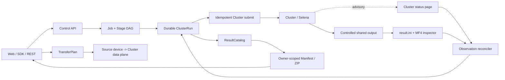

# Cluster 结果收集鲁棒性与生产复验交接

> 日期：2026-08-14
>
> 生产主机：`10.190.171.44` / 用户级 `radar-sim-v1.service`
>
> 发布 commit：`9c21c7d4c09c85ab769704f816be35eaa8d2cd38`
>
> 目标 Job：`job_42379b085fdb` / owner：`user-hny3wx`

## 1. 结论

本次问题不是 Cluster 仿真失败，而是控制面把一次状态网页访问失败错误地转换成了 `collect_results` 的终态失败：

```text
CLUSTER_GATEWAY_UNREACHABLE
```

Cluster 实际已经完成了 1/1 输入，输出目录中存在 MF4、`result.ini`、`selena.log` 和 `result.html`。修复后，控制面不再使用本地固定总时长判定结果，并且把 Cluster 状态网页降级为观测源；受控共享结果目录中的逐输入 `result.ini` 才是成功收口的必要证据。

生产复验结果：

- 发布后只重试原 `collect_results`，没有重新提交 Cluster，也没有重新传输四类资源。
- `run_simulation` 保持 attempt `1`；`collect_results` 为 attempt `2`。
- 原 `cluster_run_ref` 保持不变：`cluster-run:2e1127f698a44e73a33dad0945904a12`。
- Job 最终 `succeeded`，`1/1` 输入成功，`finalize_manifest` 成功。
- 公共结果引用：`result:sha256:c7a7fa7e614cf5c2e8e33e203be828c3c09768fbb07ee84cdf97d3b38afda392`。

## 2. 生产变更记录

### 2.1 发布前检查

- 当前线上服务：用户级 `radar-sim-v1.service`，切换前 `active/running`、`NRestarts=0`、health `ok=true`。
- 切换前控制库没有 `queued/running/cancelling/waiting/needs_input` 任务。
- 旧 release 保留：`/home/hoz2wx/radar-sim-538945e`。
- 新 release 采用不可变目录：`/home/hoz2wx/radar-sim-9c21c7d`。

### 2.2 发布动作

- 本地变更已提交并推送到 `origin/codex/new-branch`。
- 新 release 从 commit archive 解包，不在旧运行目录原地覆盖。
- 远端对新代码执行了 `py_compile`，并确认 `execute_cluster_collect()` 包含 open-ended collector 标记。
- 用户级 systemd unit 的 `WorkingDirectory` 切换到 `/home/hoz2wx/radar-sim-9c21c7d`。
- 保留 unit 回滚副本：`/home/hoz2wx/.config/systemd/user/radar-sim-v1.service.bak-538945e`。
- 切换后服务 PID 为 `1237308`，`active/running`，`NRestarts=0`；health 和 Cluster executor/gateway 能力检查通过，Cluster 可用 worker 数为 `2`。

### 2.3 目标 Job 复验

重试时间（Asia/Shanghai）：`2026-08-14 16:05:52`；完成时间：`2026-08-14 16:06:19`。

重试前的状态链：

```text
environment_check  succeeded attempt=1
prepare_data       succeeded attempt=1
preflight          succeeded attempt=1
run_simulation     succeeded attempt=1
collect_results    failed    attempt=1  CLUSTER_GATEWAY_UNREACHABLE
finalize_manifest  cancelled upstream
```

重试后的状态链：

```text
environment_check  succeeded attempt=1
prepare_data       succeeded attempt=1
preflight          succeeded attempt=1
run_simulation     succeeded attempt=1
collect_results    succeeded attempt=2
finalize_manifest  succeeded attempt=1
```

结果证据：

- `cluster_run_ref` 未变化，Cluster run state 为 `succeeded`。
- Cluster 的外部提交值仍为 `"1"`；该部署返回的是创建任务数，不是稳定官方 Job ID，因此不能把它当作唯一追踪键。
- Manifest：`file_count=9`、`total_input_count=1`、`succeeded_input_count=1`、`failed_input_count=0`。
- ResultCatalog 公共文件共 6 个，MF4 大小 `107066136` bytes，MF4 checksum 为 `sha256:f9df6c96c388045f971dab83be0d38b97f44b9e5ad8f82b958bf37178f9ed5c5`。
- Result archive 大小 `1324745` bytes，archive checksum 为 `sha256:6ccb5c2b4b5eb7757837bacdb98fe18596e2d0bc67c3a618943f8d41c5dc4498`，远端下载后 `unzip -t` 通过。
- 原四个 TransferPlan（dataset、runtime bundle、runtime XML、mat filter）均保持 `completed`，没有新增计划。

## 3. 当前实现的边界

当前修复位于 `core/cluster_stage_executor.py` 的 `execute_cluster_collect()`：

1. 不再计算本地 `deadline`，collector 使用持续观测循环。
2. 每轮先检查本 Job 的受控共享输出目录，再访问 Cluster 状态网页。
3. 状态网页临时超时、连接拒绝或连接重置时，保留 `running`，按退避间隔继续探测。
4. 状态网页先报告 `succeeded`，但共享目录只有 MF4、`result.ini` 尚未到齐时，继续等待，不把结果复制延迟判为失败。
5. `result.ini` 的逐输入成功/失败证据覆盖 Cluster 页面粗粒度的 `finished/succeeded`。
6. 显式取消、Cluster 明确失败和完整共享结果证据仍然可以形成终态。

这里的“无固定总超时”只针对控制面的结果观测，不等于取消 Cluster 自己的执行保护。Cluster 生成的 `Config.cfg` 仍可以有执行级 timeout；这个 timeout 负责让真正失控的外部执行失败，而不是让控制面在结果尚未可见时猜测失败。

当前实现仍然会让一个 Linux executor worker 在 collector 内等待，但通过独立 heartbeat 保持归属存活，并依赖持久化 Job/ClusterRun 和 lease reclaim 在进程死亡后恢复。这是本次线上修复选择的最小变更；完整系统应进一步演进为异步 reconciler，见第 5 节。

## 4. 完整系统拓扑



系统应明确分成四个平面：

| 平面 | 责任 | 不负责什么 |
|---|---|---|
| Control plane | Job/Stage DAG、owner、幂等键、状态、取消、审计事件 | 不解释 Selena 内部算法结果 |
| Execution plane | Cluster 调度、worker、Selena 执行、执行级 timeout | 不决定控制面是否已经拿到完整结果 |
| Data plane | MF4、Runtime、DLL、MatFilter 的源到目标传输 | 大文件正文不经过 Linux API |
| Result plane | 共享目录扫描、逐输入 `result.ini`、MF4 校验、ResultCatalog、Manifest | 不重新提交已经成功提交的 Cluster run |

## 5. 完整系统设计与取舍

### 5.1 核心实体与不变量

#### Job

对用户可见的业务容器，拥有一个稳定 `job_id`、owner、UserRunConfig、Stage DAG 和最终 Manifest。

不变量：

- Job 的 owner 不能由请求体任意切换。
- Job 终态只由 DAG 和已验证结果驱动，不能由一次 HTTP 请求超时直接写成失败。
- Job 重试是 Stage 级重试；只有明确允许的 Stage 才能重新执行。

#### ClusterRun

一次真实 Cluster 提交的持久化身份，包含 `run_ref`、owner、control job、配置引用、受控 job 目录、外部提交返回值和状态。

不变量：

- `run_ref` 是提交与收集之间的主键，不能用外部提交返回的任务数代替。
- `run_simulation` 成功后，重试 `collect_results` 只能复用同一个 `run_ref`。
- 除非用户明确取消后重新创建业务运行，否则不得因为状态页不可达而再次提交同一仿真。

#### Observation facts

不要只保存一个被覆盖的 `state`，应保存事实来源和时间：

- `web_status_observed_at`、页面状态、任务行数、错误类型；
- `output_probe_at`、输出目录是否存在、文件数量、字节数、结果文件数量；
- `last_evidence_change_at`、最近一次文件 size/mtime/checksum 变化；
- `result_ini_summary`、成功/失败输入数、错误摘要；
- `observer_attempt`、当前退避时间、`next_poll_at`、`wait_reason`；
- collector lease、lease owner、lease expiry、cancel 请求。

状态是派生值，事实才是审计依据。

### 5.2 证据优先级

建议固定为以下顺序：

1. 用户取消或管理员明确停止；
2. 受控共享目录中预期数量的逐输入 `result.ini`，并完成 MF4/结果文件一致性校验；
3. Cluster 提供明确、可追踪的终端失败事实，例如 worker failed、cancelled、aborted 及稳定错误码；
4. Cluster 状态网页的 `running/succeeded` 只作为观测和加速信号，不能单独证明成功。

关键取舍：共享目录扫描比读取状态网页慢、也需要处理文件复制中的半成品，但它是离 Selena 结果最近的证据，能避免“页面完成、结果还没复制完”和“页面成功、`result.ini` 实际失败”两类误判。

### 5.3 时间语义：四种时间不能混成一个 timeout

| 时间概念 | 是否允许超时 | 终态影响 |
|---|---:|---|
| Selena/Cluster execution timeout | 允许，由 Cluster Config 或部署策略控制 | 外部执行明确失败时可形成失败 |
| Control observer total deadline | 不设置固定总 deadline | 状态页暂时不可达不能形成失败 |
| Observer poll backoff | 允许，带上限和 jitter | 只影响下一次观测时间，不改变 Job 结果 |
| Agent/collector lease | 允许短租约并续租 | 只用于故障接管，不等价于仿真超时 |

这样既不会让十小时批量仿真被控制面提前杀掉，也不会因为一个 worker 进程死亡而留下永久孤儿任务。

### 5.4 当前阻塞式 collector 与目标异步 reconciler

#### 当前版本：阻塞式、低风险

- 一个 Stage worker 执行 collector 循环；
- 独立 heartbeat 线程维持 Agent/Stage 归属；
- 每轮读取共享结果和状态网页；
- 进程死亡后由 Agent lease reclaim 恢复 Stage。

优点是改动小、容易直接复用当前 Stage executor、能够立即修复本次误失败。缺点是长批量会长期占住一个 worker，吞吐量依赖 worker pool 大小。

#### 完整版本：持久化、异步、可水平扩展

把 `collect_results` 拆成“事实采集”和“调度下一次采集”两个短任务：

1. `ClusterRun` 创建一个 observation record，初始 `next_poll_at=now`。
2. Reconciler 使用数据库 lease 原子 claim 到期 observation，单次只做一轮有限工作。
3. 采集状态网页、共享目录元数据和 `result.ini` 摘要，写入 append-only observation/event 表。
4. 根据事实计算 `observation_state`：`submitted`、`running`、`waiting_for_status`、`waiting_for_results`、`terminal`、`cancel_requested`。
5. 未到终态则写入 `next_poll_at` 和 backoff；释放 lease，worker 立即处理其它 Job。
6. 到齐完整结果后原子写入 ClusterResult、ResultCatalog 和下一 Stage wake-up 事件。

建议的最小字段：

```text
cluster_run_ref
observation_state
next_poll_at
last_status_observed_at
last_output_observed_at
last_evidence_change_at
wait_reason
status_error_class
success_count
fail_count
expected_count
observer_attempt
lease_owner
lease_until
cancel_requested
```

异步 reconciler 的代价是需要新增数据库迁移、claim/lease 并发测试、重复 wake-up 幂等和运维可视化。它不是本次线上修复必须引入的风险，因此本次先部署阻塞式修复，后续独立 Sprint 再演进。

### 5.5 失败矩阵

| 场景 | 控制面行为 | 是否重跑 Cluster |
|---|---|---:|
| 状态网页 timeout/connection refused | 保持运行，指数退避，继续扫描共享结果 | 否 |
| 页面显示 finished，MF4 正在复制 | `waiting_for_results`，等待 `result.ini` 和文件稳定 | 否 |
| 页面显示 succeeded，`result.ini` 有失败 | 按逐输入证据形成 failed/partial 结果 | 否 |
| 页面显示 failed 且有稳定错误码 | 记录 Cluster 基础设施失败，可提供 retry collect 或重新运行动作 | 默认否 |
| Cluster run 已提交但控制面进程重启 | 从 ClusterRun 恢复，重新 claim collect | 否 |
| collector worker 失联 | lease 过期后由其它 worker 接管 | 否 |
| ResultCatalog 归档时源文件变化 | 保持 ClusterRun 可重试，重新归档 | 否 |
| 用户取消 | 写 cancel 事实；必要时调用受控 Cluster cancel | 不自动重跑 |
| 共享目录永久不可达 | 保持非终态并发出 stale/incident 告警，等待取消或运维恢复 | 否 |

最后一行是有意的：告警时间可以存在，但告警不能自动伪装成业务失败。若产品必须自动回收，应增加独立的“运维策略 deadline”，由管理员配置，并明确它是运营保护而非仿真结果判断。

### 5.6 可观测性设计

每次 observation event 至少记录：

```text
job_id, run_ref, owner, observer_attempt,
source=web_status|shared_output|result_ini|cancel,
observed_at, state, wait_reason,
expected_count, success_count, fail_count,
file_count, total_bytes, error_class
```

UI/SDK 不应只显示“运行中”，还应显示：

- `running / waiting_for_status`：Cluster 状态页暂时不可用；
- `running / waiting_for_results`：Cluster 已结束或有输出，但结果文件还未齐；
- `running / recovering_observer`：控制面刚重启，正在恢复 lease；
- `succeeded / failed / cancelled`：终态和证据引用。

告警指标建议包括：观测延迟、状态页连续失败次数、共享目录最后增长时间、结果文件完成率、lease 接管次数、归档重试次数和每个 worker 的占用时间。告警阈值可以按分钟统计，但不能直接把阈值当成仿真失败条件。

### 5.7 主要设计取舍

| 决策 | 选择 | 放弃的东西 | 原因 |
|---|---|---|---|
| 成功依据 | `result.ini` + MF4 + 共享目录 | 只信 Web 页面 | 正确性优先，能识别 Selena 内部逐输入失败 |
| 观测期限 | 无固定总期限 | 自动快速失败 | 批量仿真可能持续数小时；用告警和取消处理真挂死 |
| 重试边界 | Stage retry 复用 ClusterRun | 失败即重新提交 | 避免重复仿真、重复传输和重复输出 |
| 当前执行模型 | 阻塞 collector + heartbeat | 立即引入异步调度 | 本次风险最小，先修线上误判 |
| 长期执行模型 | 异步 reconciler + DB lease | 无限占用 worker | 提升多用户吞吐，但需要更大 schema/并发改造 |
| 大文件传输 | 源设备直写 Cluster 数据面 | 经过 Linux API 中转 | 降低控制面带宽和内存压力，但依赖部署 mount/权限 |
| 批量结果 | 逐输入结果 + aggregate manifest | 只给一个总状态 | 保留 partial 和定位失败输入的能力 |
| 当前身份模式 | 受信内网 owner 路由 | 假装成多租户安全 | `X-Rsim-User` 可伪造；正式开放前必须启用 Bearer/SSO |

## 6. 后续实施路线

### P0：已完成

- 删除控制面的固定总观测 deadline；
- 状态网页错误改为可恢复 observation；
- MF4/result.ini 延迟复制保持非终态；
- 生产部署并用原 Job 的 collect retry 验证；
- 旧 release 和 systemd unit 备份可回滚。

### P1：异步 reconciler

- 增加 observation 表和 schema migration；
- 实现 due claim、lease、backoff、jitter 和重复 wake-up 幂等；
- 把 `collect_results` 从长调用改成短轮次任务；
- 增加服务重启、两个 reconciler 并发、lease 过期接管测试。

### P2：运维与用户可见状态

- 增加 `wait_reason`、last evidence time、result completeness；
- 提供 cancel、retry collect、重新运行三个明确动作；
- 增加 stale 告警和按 owner/run 的审计查询；
- 大批量结果展示加入 truncation 和分页。

### P3：正式多租户

- 启用 Bearer/SSO 或受信反向代理；
- 服务端从认证 principal 派生 owner，不再接受任意 `X-Rsim-User`；
- 验收跨 owner 的 Job、Run、Transfer、Result、Agent 全链路拒绝。

## 7. 验收清单

- [x] 状态网页不可达时不产生 `CLUSTER_GATEWAY_UNREACHABLE` 终态。
- [x] 虚拟时间跨越旧观察窗口后仍能等到共享结果。
- [x] 页面先完成、`result.ini` 后到达时不会误报成功或失败。
- [x] 大批量扫描截断后会做有界复扫。
- [x] 生产目标 Job 只 retry collect，不重新 submit Cluster。
- [x] 生产 Job 1/1 succeeded，Manifest、ResultCatalog 和 ZIP 均可用。
- [ ] 异步 reconciler schema、lease claim 和水平扩展仍待独立 Sprint。

## 8. 回滚

如新 release 出现服务启动或结果收集回归：

1. 停止当前用户级 `radar-sim-v1.service`；
2. 将 `WorkingDirectory` 恢复为 `/home/hoz2wx/radar-sim-538945e`，或恢复 unit 备份 `radar-sim-v1.service.bak-538945e`；
3. `systemctl --user daemon-reload && systemctl --user start radar-sim-v1`；
4. 先检查 health、executor/gateway 能力和现有 Job，再决定是否 retry；
5. 不删除 `/home/hoz2wx/radar-sim-9c21c7d`，保留现场供差异分析。
