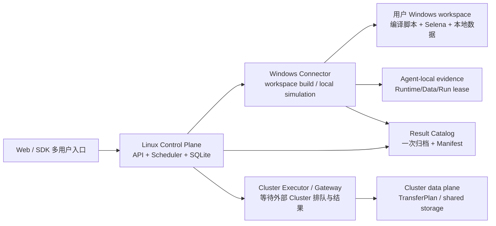

# radar-sim 长耗时、多用户与批量仿真完整加固 handoff

日期：2026-08-17  
状态：已修复、已部署、已用真实 Job 验证  
最终代码：`b66baa0`（`origin/codex/new-branch`）  
最终 Linux release：`/home/hoz2wx/radar-sim-b66baa0`

## 1. 结论先行

当前 V2 主链已经能够支持 Web 多用户触发本地或 Cluster 仿真，并对单条数据和多条数据保持同一套 Stage 合同：

- 每个 Job 按 owner 隔离，Stage 回调按 Agent、Stage、attempt 校验；迟到或跨任务回调不会污染当前任务。
- 同一 Windows workspace 的编译通过 OS 级 workspace lock 串行化；不同 workspace/不同 owner 可以并行排队执行。
- 默认编译和本地仿真没有框架总时长上限；`0` 表示 unlimited。正数只能来自用户/部署策略，不再被隐藏截断到 24 小时或 7 天。
- 批量输入按单个 input checkpoint 记录，已成功的输入不会因为 Connector 重启或网络重试而重新运行。
- 本地 Runtime/Data/Artifact evidence 在重新验证内容、checksum、worktree 后续租；时间戳是空闲缓存回收提示，不是仿真截止时间。
- `collect_results` 只做一次物理归档；`finalize_manifest` 消费已上传的 `result_ref`，不会再次扫描或复制大目录。
- 失败重试按 Stage 进行。旧数据库中已经生成的、缺少新字段的 finalizer payload 也会在 `retry_stage` 时从可信的前序 Stage 结果自动修复。

真实验收任务 `job_a9729157d497` 的最终状态为 `succeeded`：

- `build_selena`：成功，attempt 1；本次 finalizer 修复没有重新编译。
- `run_simulation`：成功，attempt 1；本次 finalizer 修复没有重新仿真。
- `collect_results`：成功，attempt 1，1 个输出文件，`239051624` bytes。
- `finalize_manifest`：attempt 3 成功；attempt 1/2 是旧 payload 在旧服务版本上的失败，attempt 3 只执行最终阶段。
- Manifest：`schema_version=radar-sim.run-manifest/2.0`、`status=succeeded`、`delivery.status=delivered`、`file_count=1`。
- 结果下载接口返回 HTTP 200，`content-type=application/zip`，归档大小 `12163239` bytes。

## 2. 产品定位

radar-sim 是 Selena 的控制面和可靠执行外围，不替代 Selena，也不假设某一个固定项目。它负责把一份 `UserRunConfig 2.0` 转成可追踪的资源准备、编译、仿真、结果收集和 Manifest 流程。

控制面必须回答的是：

1. 这个 Job 属于谁，应该走 local 还是 Cluster。
2. 哪个 Agent/Cluster executor 可以执行当前 Stage。
3. 当前 Stage 的输入证据是否仍然有效。
4. 结果是否已经持久化，重试是否可以只从失败边界继续。

Selena 内部的排队、算法错误、DLL 行为和 Cluster 供应商调度属于执行环境边界；框架不把它们伪装成控制面成功。

## 3. 系统拓扑

数据流和控制流分开：Linux 负责状态、租约、owner、Stage 和 Manifest；Windows 负责本机文件、Visual Studio、编译和 Selena；Cluster 负责自己的执行排队。Linux 不通过 HTTP 接收 MF4 正文，也不在 Linux 上编译 Selena。

## 4. 核心设计原则

### 4.1 长耗时不是异常

- `cli/agent.py::_build_timeout_seconds()` 默认返回 `0`。
- `core/agent_local_run.py` 的 `timeout_seconds=0` 进入无 wall-clock deadline 分支。
- 本地 Selena runner 仍受取消、进程存活、Connector heartbeat 和 OS 进程树管理；这些是控制机制，不是仿真时长猜测。
- 正数 timeout 是显式运维策略。框架不再偷偷把 build 截到 86400 秒，也不再把 local run 截到 7 天。
- Legacy CLI 的 `max_duration_per_file_sec`、`stall_timeout_sec` 仍是显式用户配置；未配置时不启用。

### 4.2 Lease 是可验证的活动租约

Runtime Bundle、Data、Artifact 和 local run evidence 不只看时间：

1. 先验证文件/归档/checkout 的完整性和 checksum。
2. 验证通过后，才把 lease expiry 向后滑动。
3. 文件缺失、被替换、链接类型不正确或 checksum 改变时 fail closed。
4. Direct transfer 的 `TransferPlan` 在接受进度 heartbeat 后续租；没有活动的废弃传输仍会过期回收。

因此，超长任务不会因为“创建后超过 24 小时”自动失败，但断网、Agent 关机或完全没有进度的 abandoned transfer 仍会被发现。

### 4.3 Stage 是幂等边界

每个回调都必须绑定：`job_id + stage_id + agent_id + attempt`。服务端拒绝：

- 旧 attempt 的迟到结果；
- 其他 Agent 冒充当前执行者；
- 一个 owner 访问另一个 owner 的 Job/Result/Transfer；
- 已成功 Stage 被重复执行造成第二份物理副本。

Connector 本地 terminal result 写入 outbox，网络恢复后再投递；控制面重启或 Connector 重启不会把已 checkpoint 的输入重新运行。

### 4.4 路由显式化

`register_artifact` 不是天然的 Cluster 上传：

- local：`local_runtime_registration`，只验证/复用同一 Windows Agent 的 Runtime Bundle lease；
- cluster：`direct_transfer`，只使用签名的 TransferPlan；
- `source_to_local`、`gateway_upload` 等没有部署适配器的路径 fail closed，不猜路径、不把源文件偷偷写入错误命名空间。

### 4.5 编译是通用策略，不绑定项目

`core/build_script_policy.py` 对 BAT/CMD、PowerShell、Python、Shell 和常见构建工具做通用识别：

- R2D2 `-clean/clean`；
- CMake clean-first/clean target；
- MSBuild/devenv clean；
- 常见 build tool clean token；
- `git clean` 和递归输出目录删除。

命中的活动 clean 命令会使用对应脚本语言的注释符号注释掉，保留原文、可审计、可逆，并且不写死 `ovrs25`、`byd` 或某一个项目路径。已有工程默认增量编译；只有用户显式要求 clean 时才进入显式清理策略。

## 5. 关键代码映射

| 能力 | 代码位置 | 保护点 |
|---|---|---|
| 通用 clean 抑制 | `core/build_script_policy.py` | 项目无关、语言感知、可审计 |
| workspace 识别与编译锁 | `core/environment_snapshot.py`、`core/build_lock.py`、`cli/agent.py` | 同 workspace 串行，跨 workspace 并行 |
| local/Cluster 路由 | `core/stage_routing.py`、`core/stage_binder.py` | 不把 local registration 当 transfer |
| Stage attempt/owner 校验 | `core/control_service.py`、`core/api_v1.py` | 拒绝迟到、越权、错 Agent 回调 |
| local run lease/checkpoint | `core/agent_local_run.py` | 单输入 checkpoint、重启恢复、取消 |
| Connector outbox | `core/agent_result_outbox.py`、`cli/agent.py` | 结果先落本地，再可靠投递 |
| Runtime/Data/Artifact 续租 | `core/agent_runtime_bundle_lease.py`、`core/agent_data_lease.py`、`core/agent_artifact_lease.py` | 先完整验证，再续空闲租约 |
| 长传输活动租约 | `core/transfer_service.py` | accepted progress heartbeat 滑动 expiry |
| finalizer 绑定 | `core/stage_binder.py` | 优先可信 Stage result，回退 resolved snapshot |
| 旧 finalizer retry 修复 | `core/control_service.py::retry_stage` | 只重试 finalizer 也能重建 runtime/result handoff |
| 结果归档与 Manifest | `cli/agent.py`、`core/local_results.py` | 一次归档、path-free Manifest、幂等引用 |

## 6. 一次 Job 的可靠执行流程

1. Web/SDK 提交 `UserRunConfig 2.0`，控制面确定 owner 和 selected target。
2. `resolve_spec` 只做资源识别和授权，不把项目名当作执行路由。
3. `environment_check` 验证 workspace、VS、Runtime XML 和能力；编译脚本在 Windows Agent 上做通用 clean-policy adaptation。
4. `build_selena` 在 workspace lock 内执行。已有产物不先清除；输出经 Bundle manifest、DLL、Runtime XML 和 checksum 校验。
5. `register_artifact` 按 selected target 选择 local lease 或 Cluster TransferPlan。
6. local `preflight` 验证本地数据、Runtime Bundle、资产和配置，然后创建一个 owner/Agent 绑定的 local run lease。
7. `run_simulation` 启动 Selena；长批次按 input 记录 checkpoint，Connector 独立 heartbeat，取消走控制面。
8. `collect_results` 从 immutable local run evidence 生成一次结果归档，并通过可重试 upload/delivery 发布 `result_ref`。
9. `finalize_manifest` 只读取 `result_ref + local_run_lease_ref + path-free delivery summary`，生成公开 Manifest，不重新拷贝大文件。
10. 任一阶段失败时，Web 提供精确 Stage retry；成功的前序 Stage 保留，不强制从编译重新开始。

## 7. 本次真实故障的完整根因链

这次不是 Selena 或 Cluster 内部失败，而是两个控制面/契约问题叠加：

1. 初始 `register_artifact` 把 local Job 错走成 direct transfer，已修复为 route-aware registration；旧 Connector 被 v12/v13/v14 contract gate 拒绝继续领取旧任务。
2. Runtime/Data lease 的时间戳曾被当成硬过期时间，导致归档内容没有变化时仍然无法恢复；现在改成内容重新验证后的活动/空闲租约。
3. `collect_results` 成功后，local registration 没有共享 `storage_ref`，所以 `complete_runtime_bundle_registration` 不会更新公开 resolved snapshot；但 Runtime Bundle identity 仍然可靠地存在于 `register_artifact.result.runtime_bundle.id`。
4. 旧 `bind_local_stage_after_result` 只查 resolved snapshot，给 `finalize_manifest` 的 `runtime_bundle_id` 为空，于是仿真和收集都成功后才在最后一步抛 `ValueError`。
5. 第一次修复让新生成的 finalizer payload 使用可信 Stage result；随后发现对历史失败 Stage 做“只重试 finalizer”时，`retry_stage` 会保留旧 payload。第二次修复在 retry 时重建 `runtime_bundle_id/result_ref/delivery`，因此不需要再次编译或仿真。

## 8. 风险矩阵

| 风险 | 可能表现 | 当前处理 | 状态 |
|---|---|---|---|
| Connector 版本落后 | 看似在线但不能领取新 Stage | contract version gate + 官方一键更新 | 已保护，当前 v14 |
| 旧 local finalizer payload | 最后一步 `local_stage_failed` | 正常 binder + retry payload repair | 已修复，真实 Job 验证 |
| lease 时间固定过期 | 排队很久后无效重试 | immutable revalidation + renewal | 已修复 |
| 编译脚本误 clean | 删除已有工程导致后续失败 | 通用 clean 命令抑制，默认增量 | 已修复 |
| 同 workspace 并发编译 | 产物互相覆盖 | workspace build lock | 已保护 |
| 长仿真被框架误杀 | 大批量数据运行到固定时长失败 | 默认 unlimited；取消/进程存活独立 | 已修复 |
| 静默但仍在计算的 Selena | 被误判 stalled | heartbeat；stall 仅显式配置才启用 | 已保护 |
| 批量中途 Connector 重启 | 从第 1 条重新运行 | per-input checkpoint + local lease | 已保护 |
| 结果上传断网 | 结果已生成但 Job 无引用 | resumable upload + outbox + result_ref 幂等 | 已保护 |
| finalizer 二次复制大目录 | 大文件重复 I/O、超时、空间增长 | collect 一次 materialize，finalize 只读归档引用 | 已保护 |
| 迟到/重复回调 | 旧结果覆盖新 attempt | owner/Agent/attempt 校验 | 已保护 |
| 多用户数据串用 | 一个用户看到另一个用户结果 | owner scope、Agent binding、Result/Transfer ownership | 已保护（受认证边界约束） |
| 无认证部署下伪造 owner | 受信内网任意调用者可伪造 `X-Rsim-User` | 当前只适合受信内网；生产必须 Bearer auth | 未消除，明确外部安全边界 |
| 磁盘满、权限、杀毒软件锁文件 | build/upload/result 任一步 I/O 失败 | preflight、checksum、稳定错误码；不能替用户修复 OS | 外部环境风险 |
| VS/SDK/DLL/Runtime 不匹配 | build 或 Selena 启动失败 | VS 检测、Bundle manifest、preflight | 受控但依赖用户环境 |
| MF4 被生产者改写 | 输入与准备阶段不一致 | 运行前再次 checksum 验证 | 已保护 |
| Agent 关机/睡眠/网络断开 | Job 等待连接或重连 | supervisor/watchdog/outbox/reclaim | 外部设备可用性风险 |
| Cluster 内部排队/供应商失败 | Cluster 等待或执行失败 | framework collector open-ended，显示外部状态 | 外部执行器边界 |
| 结果保留期/存储回收 | 很久后下载不到结果 | `retain_until` + Result Catalog；需部署磁盘/GC 策略 | 需要运维容量策略 |

## 9. 设计取舍

### 默认 unlimited vs 防止死进程

选择默认 unlimited 是因为框架无法从“没有新日志”推断 Selena 卡死。死进程问题通过 OS process liveness、heartbeat、用户取消、服务重启恢复和显式 timeout 处理。代价是部署方必须监控磁盘、进程数和资源使用；这比静默杀掉一个仍在处理的大批量任务更符合仿真系统语义。

### 活动租约 vs 固定总时长

选择 idle lease 而非 wall-clock deadline，避免长传输/长排队被创建时间误伤；保留 idle expiry 是为了回收断线、无人维护的资源。租约续期前必须完整验证内容，避免“只要有 heartbeat 就信任被替换文件”。

### 只重试失败 Stage vs 全链路重跑

选择 Stage retry，减少编译和 Selena 的昂贵重复执行；这要求前序结果 durable、结果引用幂等、handoff payload 可重建。本次历史 finalizer 缺陷证明 retry repair 必须是控制面的一等能力，不能只把 Stage 状态改回 queued。

### local registration 不上传共享产物 vs 统一传输

local 仿真本来就需要 Runtime Bundle 留在同一台 Windows Agent；强行走 Cluster transfer 会浪费大文件 I/O，并在没有 Cluster target 的情况下失败。代价是 local Bundle identity 需要从可信 Stage result 传递，而不能只依赖公开 snapshot；现在两条路径都已覆盖。

### 同 workspace 串行 vs 最大并行度

同一 workspace 的编译共享中间产物，强行并行会产生不可解释的竞态，所以选择串行。不同 workspace 或已有独立 Runtime Bundle 的任务仍可并行；同一 Agent 的本地 Selena run 也按 lease/资源边界排队。

### clean 命令注释 vs 删除/强制重写脚本

注释命令保留用户脚本原文和审计痕迹，且跨项目、跨语言；代价是工作区脚本会产生可见修改，发布和审查必须记录这一变化。当前策略绝不写死某个项目路径，也不凭字符串替换删除任意命令。

## 10. 发布与验证证据

### 代码与自动化测试

- `b767fc2`：finalizer 使用可信 Bundle identity、活动 TransferPlan lease、去掉显式 24h/7d 隐藏上限，Connector contract v14。
- `b66baa0`：`retry_stage` 修复历史 local finalizer payload，并增加回归测试。
- 最终全量：`1626 passed, 12 skipped, 1 warning in 520.88s`。
- 唯一 warning 是已有的 Starlette/httpx deprecation，不影响 Job 执行。

### Linux 服务

- 地址：`http://10.190.171.44:8877`
- release：`/home/hoz2wx/radar-sim-b66baa0`
- systemd：`radar-sim-v1.service`，`active/running`，`NRestarts=0`，最终观测 PID `2695307`
- 回滚备份：`radar-sim-v1.service.bak-b66baa0`、`radar-sim-v1.service.bak-b767fc2`
- health：`ok=true`、`api_version=v1`、当前 no-auth deployment

### Windows Connector

- 官方 installer：`connect-radar-sim-b767fc2.ps1` 下载并执行成功
- Connector contract：`14`
- Agent：`agent-HOZ2WX-WX8-C-0001A-8eb997b96324`
- 服务端能力：Windows `available=true`、`count=1`、`update_required=false`；Cluster `count=2`
- 实际线上包：`8376976` bytes，SHA-256 `156c0a23ce5f3ee2ad927f38f62a451aadf5483d88780e23d2337a21fe9e758d`

### 真实 Job

- Job：`job_a9729157d497`
- 输入：1 个 MF4，准备阶段识别为 local dataset
- build：attempt 1 succeeded，Runtime Bundle `selena-bundle:sha256:7723d6132703d05cae5f2588f38dba994590c12bd4a571ce84d50a6fe5e33c18`
- simulation：attempt 1 succeeded，单输入 returncode 0
- collection：attempt 1 succeeded，1 个文件、239051624 bytes
- finalizer：attempt 3 succeeded，Manifest available，结果引用 `result:sha256:6495b423d48369557f5d931c28f3e445c6902c9175f3261609fb481a6d2644e8`
- 下载验证：HTTP 200，ZIP `12163239` bytes，服务端 `content-disposition` 正常

## 11. 仍需明确的边界与下一步

当前代码和真实 Job 已证明“同一控制链正常成功”，但以下事项仍不能用一次成功任务替代压力验收：

1. 用两个真实 owner 同时提交 local Job，验证 no-auth 之外的正式 Bearer 身份和 owner 隔离。
2. 用同一 owner 的多条输入批量 Job，主动制造 Connector 重启/上传断点，验证 checkpoint 和 outbox 在真实网络下恢复。
3. 用两个不同 workspace 并行编译，再用同一 workspace 双 Job 验证预期串行排队。
4. 用真实 Cluster 长时间排队任务验证外部 Cluster 的 job identity、collector、结果保留和失败回传；Cluster 内部流程仍由 Cluster 系统负责。
5. 为 production 打开 Bearer authentication/短期设备 pairing；当前 no-auth 模式只允许受信内网，`X-Rsim-User` 不是认证。
6. 增加部署级磁盘配额、Result GC、指标/告警，尤其监控 local run archive、outbox、TransferPlan idle expiry 和 stale Agent。

这些是容量、安全和外部执行器验收，不是本次 `job_a9729157d497` 失败的未修复代码路径。

## 12. 回滚与排障顺序

若新 release 启动失败：

1. 不删除 `/home/hoz2wx/radar-sim-b66baa0`，保留现场。
2. 恢复 systemd unit 到对应 `.bak-*`，执行 `systemctl --user daemon-reload` 和 `systemctl --user restart radar-sim-v1.service`。
3. 先检查 `/api/v1/health`、`/api/v1/capabilities`、Connector contract，再看 Job。
4. 对失败 Job 先看 diagnosis 和 Stage events；只重试明确失败的 Stage，不默认重新编译/重新仿真。
5. 对长任务不要按固定分钟数判断失败；检查 heartbeat、进程存活、cancel_requested、lease 最近验证时间和外部 Cluster 状态。

