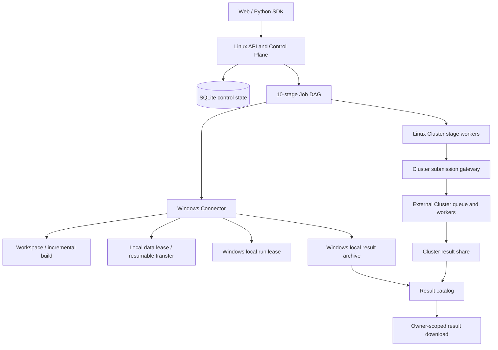

# radar-sim 非仿真内部失败全流程故障树审计

日期：2026-08-17  
范围：Web/SDK 提交到最终结果可用的全部控制面、数据面、Windows Connector、Cluster 适配和结果交付路径。  
明确排除：Selena/仿真引擎自身返回的业务失败，例如 `selena_failed`、`simulation_engine_failed`、输入信号不匹配等。它们仍需要展示和归档，但不作为本审计的框架故障。

## 结论

之前的修复主要验证了正常路径和单个真实 Job，但正常路径通过不等于流程具备生产鲁棒性。本次审计补齐了几类会造成“仿真已经完成或可以继续，但 Web Job 最终失败、永久 queued、重复提交或结果不可用”的框架级断点。

当前工作树中的代码已经覆盖：

- 长耗时编译、长耗时本地批量运行和 Cluster 排队不使用隐藏 wall-clock 上限；
- 数据集、Runtime Bundle、配置资产和结果归档的 resumable upload 使用可续租 idle lease；
- Cluster 外部提交使用提交收据和 Config.cfg 路径反查，避免控制面重启后重复提交；
- Agent 心跳丢失后，旧 attempt 的终态 outbox 回调在没有新 attempt 抢占时可以被安全接管；
- 维护线程同时负责 stale recovery 和持久化 Stage handoff 重放；
- Cluster 批量结果不再只保留前 50 个 `result.ini`，结果匹配从线性扫描改为路径索引；
- Selena 编译会校验已有 Runtime Bundle 的 branch/build-mode/entrypoint checksum provenance；跨分支、无 provenance 或旧 exe 被替换时强制全量编译；
- 缺少 direct-transfer 部署根时，在提交前阻断，不等到编译完成或数据复制开始后才失败；
- 本地执行拒绝 `dataset://`、`shared://` 和 Linux-only 路径，真实 UNC 路径仍可以在 Windows Agent 上建立绑定；
- 结果归档从 Agent/上传存储复制到中央 catalog 时使用原子发布，避免进程崩溃留下损坏的 canonical ZIP。

本文件描述的是代码级审计和修复边界。正式上线前仍必须通过双用户、多文件批量、Connector 重启、服务重启和真实 Cluster 长队列验收；外部 Windows/Cluster 环境故障不能由框架本身消除。

## 产品定位与系统拓扑

`radar-sim` 是编排层，不实现 Selena 算法。它负责配置契约、资源解析、路由、Stage 状态机、数据传输、Agent 任务执行、结果归档和可观测性。



固定 Stage 顺序：

```text
resolve_spec
  -> environment_check
  -> prepare_source
  -> prepare_data
  -> build_selena
  -> register_artifact
  -> preflight
  -> run_simulation
  -> collect_results
  -> finalize_manifest
```

其中 `prepare_data` 的 direct-transfer 可以在依赖允许的边界提前进行，但它只能通过已签发的 `TransferPlan` 完成，不能退化为 Linux HTTP 中转。

## 非内部失败故障树

### 1. 请求、身份和幂等

可能导致 Job 无法完成的原因：

- Web/SDK 发送无效 YAML、未知字段、空路径、逻辑 Bundle ID 或不支持的 target；
- 多次点击提交没有稳定 `idempotency_key`，导致两个 Job 同时进入执行；
- owner 路由不一致，Job、Agent、上传会话和结果 catalog 落在不同 owner namespace；
- 当前 Agent ID 被另一台电脑或另一个 owner 复用；
- 服务重启发生在 Job/Stage/幂等记录提交的临界区。

当前保护：

- `UserRunConfig` 使用 `extra=forbid` 和 fingerprint；
- `(owner, idempotency_key)` 唯一索引加 request hash 冲突检查；
- Agent 注册使用稳定 ID UPSERT 和 owner transition 校验；
- Job、TransferPlan、Dataset、Result 都做 owner 检查；
- 所有 Stage 状态和 attempt 写入控制 DB。

仍需特别注意：当前受信内网部署若 `authentication_required=false`，`X-Rsim-User` 只是可伪造的路由标签，不是认证。正式多租户必须启用 Bearer/SSO，并从认证主体派生 owner。

### 2. 路由和能力选择

可能导致无法完成：

- `auto` 在本地 Windows、Cluster、共享数据之间选择错误；
- 明确选择 `local`，但数据其实只有 `dataset://`、`shared://` 或 Linux 路径可读；
- 明确选择 `cluster`，但部署没有 `client_target_root` 或 Linux `server_probe_root`；
- build-to-Cluster 需要传 Runtime Bundle，但只检查了数据路径，没有检查 artifact direct-transfer；
- Cluster 只有 Linux executor 没有 gateway，或反过来；
- Connector 版本过旧，能注册但不能理解当前 Stage contract。

当前保护：

- target 选择只依据当前能力和资源语义；
- 本地 target 拒绝控制面逻辑资源，原始 UNC 路径仍交给 Windows 绑定校验；
- 真实 serve-v1 注入空 TransferService 时，缺少 direct-transfer 根会在 Job 创建时进入 `needs_input`，不再拖到后面失败；
- Cluster capability 必须同时有 executor 和 gateway；
- claim 时再次校验 Connector contract，浏览器的旧能力快照不能授权执行；
- 同一 owner 的 Windows Agent 才能领取本地资源任务。

### 3. `resolve_spec` 和本地资源识别

可能导致无法完成：

- Connector 不在线、owner 不匹配、版本过旧；
- workspace 没有绑定、绑定路径被移动、脚本不在 workspace 内；
- 同一 workspace 存在多个 `Selena.exe` 或多个候选 adapter；
- Runtime XML、Adapter、MatFilter 不存在、不可读或不在授权根内；
- UNC 路径被当成 Cluster 逻辑路径，或真实共享路径没有在 Windows 上建立 data binding；
- 大仓库识别扫描太慢，Agent 在识别前心跳过期。

当前保护：

- V2 识别只使用用户选定脚本和通用 workspace 规则，不硬编码某个产品目录；
- 绑定 ID、asset binding、data binding 均在 Agent 本地持久化并在使用前重新校验；
- `resolve_spec` 使用早期 heartbeat，识别期间不会因为没有输出日志而失联；
- 原始 UNC 路径现在可由 Windows Agent 自动建立 owner/device data binding；
- 识别失败返回稳定错误码，不把异常堆栈或本地路径发送到 Linux。

适配边界：如果构建脚本完全动态生成输出路径，既不暴露常见 `-B/--build-dir/--output` 参数，也没有可授权的现有输出目录，框架会 fail-closed，而不是扫描整个 workspace 猜测。这是安全取舍，正式使用应在 YAML/绑定中补充可验证输出根或让脚本暴露输出根。

### 4. `environment_check` 和编译前置

可能导致无法完成：

- Visual Studio、SDK、Perl/TCC、CMake、Python 或 DLL 依赖缺失；
- 构建脚本被杀毒软件、编辑器或另一个 Job 锁定；
- 脚本在环境检查和实际执行之间发生变化；
- 工作区已有编译产物，但脚本中的清理命令把它们删掉；
- 环境检查使用了固定超时，把合法的长时间准备判成失败；
- 两个用户同时修改同一个 build tree。

当前保护：

- Visual Studio 参数适配和通用 clean 语义识别都在 workspace OS lock 内进行；
- clean policy 识别 `R2D2 -clean`、CMake/MSBuild clean、`git clean`、`clean.*` 和 destructive output deletion；
- 增量模式下注释清理命令，显式 clean 才恢复；
- 实际执行前重新计算脚本 checksum；
- 编译 workspace 单飞锁，等待第二个 Job，而不是并发覆盖 build tree；
- 已有 `selena.exe` 只有在同一 workspace、同一 Selena branch、同一 build mode 且 exe checksum 与最近 Runtime Bundle provenance 一致时才允许增量；
- 发现新 Selena branch 时自动恢复并执行脚本 clean 命令；如果脚本没有可识别 clean 语义，直接阻断，不能把增量编译伪装成全量编译；
- build 默认 `timeout=0`，正数 timeout 只能来自明确运维策略；
- 脚本派生依赖只修改子进程环境，不污染机器全局环境。

### 5. `prepare_source`、构建和 Runtime Bundle

可能导致无法完成：

- branch worktree 创建失败、Git 状态无法读取、Source Lease 过期；
- 编译脚本返回成功但没有生成唯一 `Selena.exe`；
- `Selena.exe` 生成在授权 output root 之外；
- 编译后 exe、DLL、Runtime XML 被修改；
- Bundle archive 创建时源文件被替换，导致 manifest 和 archive 不一致；
- Windows 机器在构建后断电，Linux 只看到 Stage running。

当前保护：

- Source Lease、Artifact Lease、Runtime Bundle Lease 都绑定 build stage + attempt；
- Build 结束重新检查脚本、源码身份、artifact 位置、大小和 checksum；
- Runtime Bundle 至少包含一个 exe、一个 Runtime XML 和 colocated DLL；
- archive 使用 manifest、checksum 和逐文件校验；
- Agent 结果先写本地 outbox，再发终态 callback；
- Stage stale 后，旧 attempt 在没有新 attempt 抢占时可以安全提交终态结果，不强制重新编译。

### 6. `prepare_data` 和 direct-transfer

可能导致无法完成：

- 数据目录不存在、无权限、文件不是 MF4、文件在扫描后被替换；
- 批量目录包含空目录、重复相对路径、Windows 保留名称或非法字符；
- 文件在传输中修改，目标端只收到半个文件；
- TransferPlan 过期、网络断开、目标共享目录不可写、磁盘满；
- 同一上传请求重试创建多个目标根，导致重复数据或后续运行错用数据；
- 混合资源中 Dataset 已完成但 Runtime/MatFilter/Adapter 没完成，Stage 被过早标成成功；
- transfer manifest 回调丢失、重复或晚到。

当前保护：

- Dataset Lease 在发现、执行前和传输过程中都校验 size/mtime/checksum；
- TransferPlan owner/job/stage/resource role 绑定，request key 幂等；
- transfer 目标使用 owner/job/transfer 隔离根；
- `.partial` 文件可恢复，源变化时丢弃 partial，避免静默混合数据；
- 有效进度续租 idle lease；上传 session 现在也按 idle lease 续租，默认 24 小时；
- manifest 必须完整匹配计划文件集合和 checksum；
- direct-transfer Stage 只在所有 required roles resolved 后成功；
- 终态 Stage 重复收到同一 manifest 不再重写已成功状态。

### 7. Cluster 提交和外部队列

可能导致无法完成：

- `client.py` 或 XML-RPC manager 连接挂死；
- manager 已创建外部 Job，但控制面在 `mark_submitted` 前重启；
- 提交返回的是任务数量而不是 durable job ID；
- manager 返回成功但 jobs 页面暂时看不到任务；
- 重试 submission stage 时重新 enqueue 同一 Config.cfg；
- Cluster 队列排队时间很长，控制面误判为失败。

当前保护：

- submit handshake 使用独立、可配置的 transport timeout；它只限制提交请求，不限制仿真运行；
- ClusterRunStore 在外部提交成功后先记录 submission receipt，再推进本地状态；
- 重启后先读 receipt，再按唯一 Config.cfg 路径向 manager 反查，能接管已提交 Job；
- collection 以生成的 Config.cfg 目录查询，不把 manager 返回的任务数量误当 durable job ID；
- `collect_results` 没有总运行时间 deadline，Cluster 队列和仿真时长由外部 Cluster 管理；
- Cluster worker heartbeat 与 Stage 执行解耦，阻塞在外部查询时仍保持在线。

不可消除的分布式边界：如果 manager 在接受请求后、任何 receipt/状态可见之前同时发生故障，任何控制面都无法凭空证明外部副作用是否发生。当前通过路径反查、receipt 和稳定 Config.cfg 尽量缩小窗口；最终仍应要求 Cluster 提交接口提供幂等 request ID。

### 8. Cluster 结果收集

可能导致无法完成：

- status 页面短暂不可用；
- manager 显示 finished，但结果共享目录仍在复制；
- 结果目录没有挂载、权限丢失、MF4 或 `result.ini` 被延迟写入；
- 大批量结果扫描上限导致结果证据缺失；
- 输出文件与 `result.ini` 的目录关系匹配复杂度过高；
- 结果归档过程中源文件变化或 Linux 磁盘满。

当前保护：

- 先查受控结果目录，再查 status 页面；
- status 页面网络错误只作为观察降级，不立即终止外部运行；
- 只有完整 per-input `result.ini`、非空输出 MF4 和一致的结果状态才进入 terminal collection；
- batch collector 按数据集数量动态扩大扫描上限，不再固定 10,000 文件；
- 每个 `result.ini` 都保留在 manifest，取消前 50/前 200 截断；
- 输出目录按 parent 建索引，避免大批量 O(n²) 匹配；
- 结果 catalog archive 使用确定性内容、checksum 和原子发布；
- collection Stage 可以单独重试，不重新提交 Cluster 仿真。

仍需部署级补强：结果共享目录永久不可达时，当前 collector 会保持观察状态而不会凭固定仿真时间误杀任务。生产监控应增加“外部任务已 terminal 但结果目录无任何活动”的 inactivity 告警；是否自动把它变成 retryable collection failure，应由部署方根据共享存储复制特性设置，而不能使用仿真总时长硬编码。

### 9. 本地长耗时运行和结果交付

可能导致无法完成：

- Windows 进程启动失败、Runtime Bundle 解压失败、paramconfig 写入失败；
- 本地 Agent 进程重启、PID 消失、控制面暂时不可达；
- 批量中途断电，已完成输出和 checkpoint 丢失；
- 用户结果目录不存在、被 symlink/junction 保护拒绝、磁盘满或被杀毒软件锁定；
- result ZIP 已生成但上传接口断开；
- result upload 完成但 catalog import 或 HTTP response 丢失。

当前保护：

- `timeout_minutes=0` 是无 framework wall-clock limit；
- 每个 input 独立 checkpoint，重启后只恢复没有有效 checksum 的 input；
- local run lease 通过 PID/执行 token 保证同一物理运行不重复启动；
- 结果目录 delivery 是一次物理 materialization，finalize 只使用 `result_ref` 和 summary，不重复复制大文件；
- 结果 archive resumable upload 使用 owner/run_ref/checksum 幂等 session；
- 上传 session 过期但仍有 partial/staging 内容时可以续租；
- catalog canonical ZIP 采用临时文件 + `os.replace` 原子发布；
- 本地结果路径失败不会抹掉 owner-scoped ZIP，Web/SDK 仍可下载诊断结果。

### 10. Stage 状态机、回调和服务重启

可能导致无法完成：

- callback 已提交 Stage 成功，但 successor bind 在进程重启窗口丢失；
- callback 来自错误 Agent、错误 owner、旧 attempt 或已经被新 attempt 抢占；
- stale maintenance 把长运行任务误判为失败并达到固定重试次数；
- Job 完成状态与 final manifest 状态不一致；
- cancel 与 success callback 竞态；
- 维护线程被某个损坏的 legacy Job 阻塞，其他用户无法恢复。

当前保护：

- callback attempt/Agent/assignment 校验和旧回调 fencing；
- stale 默认不设置固定 max attempts，维护策略只由 liveness policy 驱动；
- stale 后旧终态 outbox callback 可在新 attempt 尚未 claim 时接管；
- Agent poll 和 server maintenance 都会重放成功 Stage 的 handoff；
- 维护循环按 Job 隔离异常，单个 legacy Job 不阻断其他 Job；
- finalizer 只消费 durable `result_ref`，不重新遍历结果目录；
- Job status 由所有 Stage terminal 状态重新计算，manifest 的业务失败不会被误报为编排成功。

## 设计取舍

### 等待与失败

仿真运行本身不使用固定总时长。只有明确的外部边界使用 timeout：HTTP 请求、Cluster submit handshake、Agent 进程回收等待。Cluster 排队、Selena 编译和本地批量运行依赖 heartbeat、进程存活、progress、文件证据和外部 terminal 状态。

### 重试与重复执行

重试必须以 Stage 为边界：

- 结果上传失败不能重新仿真；
- finalizer 失败不能重新编译；
- Cluster collect 失败不能重新 submit；
- stale callback 在新 attempt 出现后必须 fencing；
- 只有在没有新 attempt 抢占时才允许采用旧 Agent 的 durable 终态结果。

### 一致性与可用性

遇到无法证明输入、artifact、TransferPlan 或结果完整性的情况，系统选择 fail-closed；遇到可证明的暂时网络中断，系统选择等待/续租/恢复。这样会让真正的配置错误停在 `needs_input`，但不会把不完整结果伪装成成功。

### 多用户与资源隔离

owner 是业务身份，device/Agent 是执行身份，workspace/data/runtime/result 是不同资源域。不能用一个 owner header 同时承担认证、路由和资源授权。生产认证必须先于正式多租户开放。

## 当前需要补做的真实验收

以下不是仿真内部失败，必须纳入发布门禁：

1. 两个认证 owner 同时提交同一台 Cluster 的任务，验证 owner、结果和 transfer root 不交叉；
2. 同一 workspace 两个 Job，确认串行编译且第二个不会破坏第一个；不同 workspace 两个 Job，确认并行；
3. 真实多文件批量，至少覆盖 250 个输入，确认每个 `result.ini` 都进入 manifest；
4. 本地批量在第 N 个输入后重启 Connector，确认只恢复未完成 item；
5. 数据传输中断、服务重启、上传 session 空闲后恢复，确认不从零开始；
6. Cluster submission 成功后重启 control service，确认不会生成第二个外部 Job；
7. Cluster 长队列和大 MF4 结果复制，确认没有 framework wall-clock failure；
8. Windows 磁盘不足、权限拒绝、杀毒锁文件，确认返回可行动的 framework diagnosis；
9. 启用 Bearer/SSO 后验证 owner 从认证主体派生，客户端伪造 `X-Rsim-User` 无效；
10. 结果保留、磁盘水位、GC 和告警演练。

## 变更与验证记录

本次审计变更涉及：

- `core/artifact_store.py`：上传 idle lease 续租和 partial session 恢复；
- `core/dataset_store.py`：多文件 Dataset upload idle lease 续租；
- `core/cluster_runs.py`：外部 Cluster submission receipt；
- `core/cluster_stage_executor.py`：提交接管、批量结果完整性和 O(n) 输出匹配；
- `core/cluster.py`：Cluster submission handshake timeout 和完整 task result 保留；
- `core/control_service.py`：reclaimed attempt 终态 callback 接管、transfer terminal 幂等；
- `core/agent_build_stage.py`、`core/agent_runtime_bundle_lease.py`、`core/agent_policy.py`：Selena branch provenance 全量编译门禁和 Connector contract v15；
- `core/api_v1.py`：local 逻辑资源拒绝、direct-transfer 前置阻断、批量 resolved snapshot 压缩；
- `cli/agent.py`：真实 UNC 数据绑定；
- `cli/server.py`：stale recovery 默认无限制、maintenance handoff reconciliation；
- 对应 `tests/` 回归测试覆盖上述故障边界。

当前阶段：代码审计修复已完成，完整测试和生产部署仍需在本次变更上重新执行；在重新部署前不能把本文件当作线上已生效证明。
